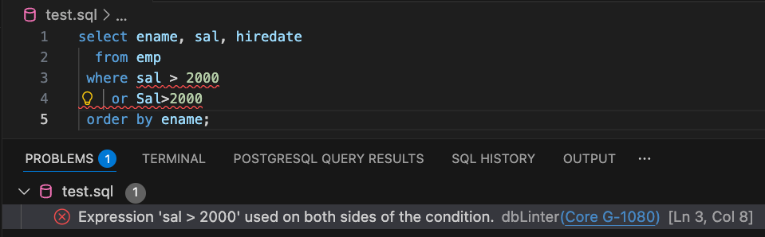

## Install the VS Code Extension

dbLinter offers an Anonymous subscription.
You don't need to sign up. And it is free, forever.
All you need to do is install the VS Code extension and you're ready to go.

import { Steps, Tabs, TabItem } from '@astrojs/starlight/components';

<Tabs>
<TabItem label="via VS Code Marketplace">
<Steps>
1. Open VS Code
2. Go to Extensions
3. Search for "dbLinter"
4. Click Install
</Steps>
</TabItem>
<TabItem label="via Open VSX Registry">
<Steps>
1. Open VSCodium, Cursor, Windsurf, Antigravity or Theia IDE
2. Go to Extensions
3. Search for "dbLinter"
4. Click Install
</Steps>
</TabItem>
</Tabs>

## Use It!

The extension is activated as soon as you open a SQL editor or notebook.

## Rule Set

The Anonymous plan is active when you use the dbLinter VS Code extension without setting up a dbLinter account.
Only those rules that should be applicable to any project without any configuration are enabled in this plan.

See [Rules](/dbLinter/#rules) for details.

:::note[Oracle Database Support]
By default, the rules are configured for projects using an Oracle Database.
:::

:::tip[PostgreSQL Support]
Set the `dbLinter Config Name` setting to `pg` to enable the subset of rules that are applicable for PostgreSQL projects.
:::