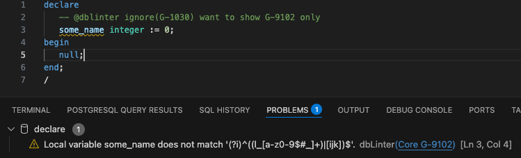
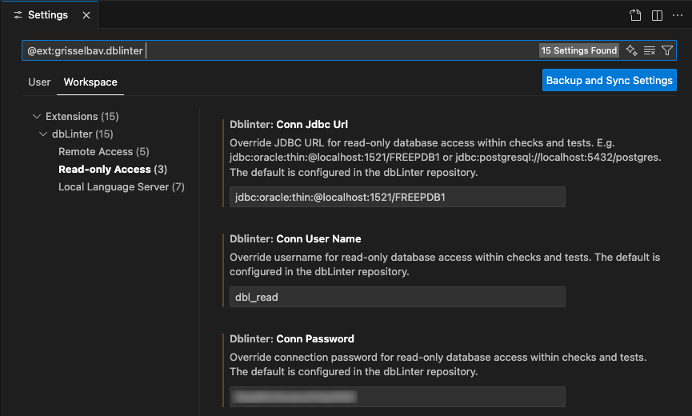

## Create a dbLinter Account

To manage a configurations, e.g. to enable/disable rules you need a free dbLinter account.

import { Steps } from '@astrojs/starlight/components';

<Steps>
1. Open the [Web GUI login dialog](https://dblinter.app/ords/r/dblinter/dblinter-console/login) and click on `Sign up`.
2. Enter your `E-mail address` and `Display name` and click on `Send token`.
3. Check your e-mails and copy the confirmation token into the clipboard and paste it into the `Confirm sign-up` dialog. Enter a password (twice) and click on `Confirm`.
</Steps>

## Manage Configuration

After you have signed in, you can manage your configuration.

A starter subscription has only one configuration. However, you can change it as you see fit.

## Set Up VS Code

Open the [Set up VS Code](https://dblinter.app/ords/r/dblinter/dblinter-console/set-up-vs-code) page and follow the instructions.
It contains the following steps:

<Steps>
1. Install VS Code as described in [Install the VS Code Extension](/dbLinter/getting-started/anonymous-subscription/#install-the-vs-code-extension).
2. Create an [Access Token](https://dblinter.app/ords/r/dblinter/dblinter-console/access-tokens)
3. Define dbLinter settings in VS Code for `Tenant Name`, `User Name`, `Access Token`, `Config Name`.
</Steps>

## Static Code Analysis

The extension is activated as soon as you open a SQL editor or notebook.

Here is an example of the [G-9102: Always follow naming conventions for local variables](https://dblinter.app/ords/r/dblinter/dblinter-console/rules#P1000_SHOW_RULE=core%20g-9102)
rule that often needs to be changed to fit the project needs and therefore is not part of the Anonymous configuration.

## Database Connection

A database connection is used for some rules to produce better results. While a database connection is optional for rules,
it is mandatory for SQL-based tests. You can define a database connection as part of the centrally managed configuration or
you can configure it locally with the VS Code settings.

## Run SQL-based Tests

Once you have configured a database connection you can run tests.

As you can see in [G-1240: Try to index foreign key columns](https://dblinter.app/ords/r/dblinter/dblinter-console/rules#P1000_SHOW_RULE=core%20g-1240) you have
to configure the `SchemaNames` parameter to ensure the SQL-based query matches your project environment.
