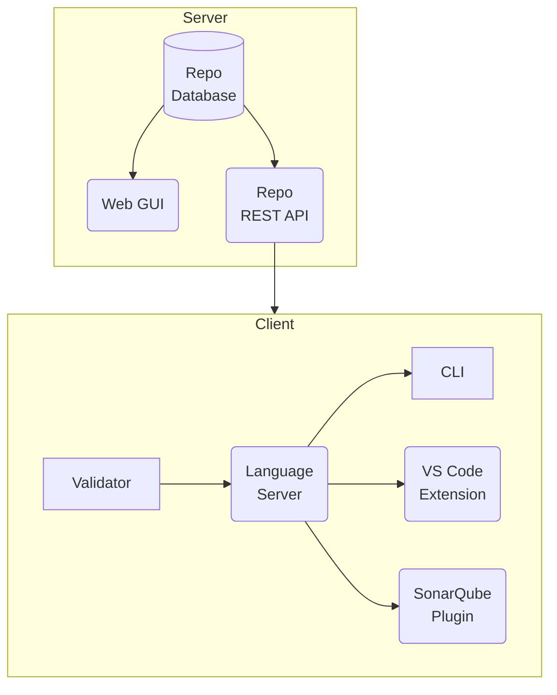

## Big Picture

Here is an overview of the components and their runtime dependencies (the target of an arrow means "used by").

## Server Components

tbd

### Repo Database

tbd

### Web GUI

tbd

### Repo REST API

tbd

## Client Components

tbd

### Validator

tbd

### Language Server

tbd

### CLI

tbd

### VS Code Extension

tbd

### SonarQube Plugin

tbd
