## Big Picture

Here is an overview of the dbLinter components and their major data flows.

```mermaid
flowchart
    subgraph Cloud ["⛅ Cloud"]
        Repo[(Repo)] <--> GUI([Web GUI])
        Repo <--> REST-API(REST-API)
        REST-API --rules--> Rule-Site([Static
                                      Rule Site])
        click Repo "#repo"
        click GUI "#web-gui"
        click REST-API "#rest-api"
        click Rule-Site "#static-rule-site"
    end

    subgraph Client ["💻 Local⠀⠀⠀⠀⠀⠀⠀"]
        LS[[Language
            Server]] <--> CLI(CLI)
        LS <--> VSCode(VS Code
                       Extension)
        LS <--> SonarQube(SonarQube
                          Plugin)
        click LS "#language-server"
        click CLI "#cli"
        click VSCode "#vs-code-extension"
        click SonarQube "#sonarqube-plugin"
    end

    REST-API --config---> LS
    LS --ignore--> REST-API
```

## Cloud Components

Cloud components are installed on servers managed by United Codes and Grisselbav.

### Repo

The dbLinter repository is implemented using the [PinkDB paradigm](https://www.salvis.com/blog/2018/07/18/the-pink-database-paradigm-pinkdb/)
with an [Oracle AI Database 26ai](https://docs.oracle.com/en/database/oracle/oracle-database/26/index.html).
For example, this means that the [Web GUI](#web-gui) and the [REST-API](#rest-api) access the database via dedicated users
based on the [principle of least privileges](https://en.wikipedia.org/wiki/Principle_of_least_privilege).

The following data areas are maintained in the repo:

- Users
- Tenants
- Rules
- Validators (implemetation of checks and quick fixes)
- Configurations
- Runtime information (sessions, logs)

### Web GUI

The dbLinter Web GUI is built with [Oracle APEX](https://apex.oracle.com/en/). It is used for managing tenant-specific data,
such as rules, configurations and user access.

### REST-API

The dbLinter REST-API is a [SpringBoot](https://spring.io/projects/spring-boot) application. It is an internal API
used only by other dbLinter components. The following subjects are covered:

| Subject | Communication via | Description                                              |
| ------- | ----------------- | -------------------------------------------------------- |
| Email   | JMS               | Send e-mails via Oracle AQ and Spring Mail.              |
| Rules   | REST              | Get the rules for generating the static rules site.      |
| Config  | REST              | Get the configuration to run checks and SQL-based tests. |
| Ignore  | REST              | Add test result to be ignored in subsequent runs.        |

All REST-API calls require authentication using an API key consisting of the tenant name, the user's email address and a personal access token.

### Static Rule Site

The [dbLinter Static Rule Site](https://dblinter-rules.united-codes.com/) is generated daily using [Svelte](https://svelte.dev/)
and the latest public rules from the dbLinter repository.
This website provides access to the dbLinter rules independently of the dbLinter tool suite, making it easier to reference rules such as
[G-9601: Never user unknown hints](https://dblinter-rules.united-codes.com/rules/G-9601/).

## Local Components

Local components run on machines controlled by the dbLinter users.

### Language Server

The dbLinter Language Server implements a subset of [Microsoft's Language Server Protocol (LSP)](https://microsoft.github.io/language-server-protocol/specifications/lsp/3.17/specification/)
using [Eclipse LSP4J](https://projects.eclipse.org/projects/technology.lsp4j). The Language Server is embedded in the [CLI](#cli) and the [SonarQube Plugin](#sonarqube-plugin).

The following LSP methods are implemented:

| Method                                                                                                                                                           | Description                                             |
| ---------------------------------------------------------------------------------------------------------------------------------------------------------------- | ------------------------------------------------------- |
| [initialize](https://microsoft.github.io/language-server-protocol/specifications/lsp/3.17/specification/#initialize)                                             | Initialize the language server.                         |
| [shutdown](https://microsoft.github.io/language-server-protocol/specifications/lsp/3.17/specification/#shutdown)                                                 | Close the dbLinter session and free resources.          |
| [exit](https://microsoft.github.io/language-server-protocol/specifications/lsp/3.17/specification/#exit)                                                         | Exit the language server.                               |
| [workspace/didChangeConfiguration](https://microsoft.github.io/language-server-protocol/specifications/lsp/3.17/specification/#workspace_didChangeConfiguration) | Apply a configuration according to the client settings. |
| [textDocument/diagnostic](https://microsoft.github.io/language-server-protocol/specifications/lsp/3.17/specification/#textDocument_diagnostic)                   | Get the issues for an URI.                              |
| [textDocument/didOpen](https://microsoft.github.io/language-server-protocol/specifications/lsp/3.17/specification/#textDocument_didOpen)                         | Add an URI and its content to the cache.                |
| [textDocument/didChange](https://microsoft.github.io/language-server-protocol/specifications/lsp/3.17/specification/#textDocument_didChange)                     | Update the content of an URI in the cache.              |
| [textDocument/didClose](https://microsoft.github.io/language-server-protocol/specifications/lsp/3.17/specification/#textDocument_didClose)                       | Remove an URI from the cache.                           |
| [textDocument/codeAction](https://microsoft.github.io/language-server-protocol/specifications/lsp/3.17/specification/#textDocument_codeAction)                   | Get the quick fixes for a text range of an URI.         |
| [codeAction/resolve](https://microsoft.github.io/language-server-protocol/specifications/lsp/3.17/specification/#codeAction_resolve)                             | Apply a quick fix.                                      |

Additionally, the Language Server implements the following non-standard JSON-RPC methods used by the [VS Code Extension](#vs-code-extension),
the [CLI](#cli) and the [SonarQube Plugin](#sonarqube-plugin):

| Method                     | Description                             |
| -------------------------- | ----------------------------------------|
| dbLinter/tests             | Get all SQL-based tests.                |
| dbLinter/runTest           | Run a SQL-based test.                   |
| dbLinter/ignoreTestResults | Save test results to be ignored.        |
| dbLinter/hasFeature        | Check if a dbLinter feature is enabled. |
| dbLinter/isConfigLoaded    | Check if the configuration is loaded.   |
| dbLinter/isUriIncluded     | Check if a given URI is in the scope.   |
| dbLinter/plsqlMetric       | Get the PL/SQL metrics for a given URI. |
| dbLinter/rules             | Get all rules.                          |

### CLI

The dbLinter Command Line Interface (CLI) is a [SpringBoot](https://spring.io/projects/spring-boot) application.
It can start a language server and run checks and SQL-based tests, producing various output formats.
The CLI is included in the [VS Code Extension](#vs-code-extension), but it can also be used standalone,
for example within a CI/CD pipeline.

### VS Code Extension

The dbLinter VS Code Extension can be installed in any IDE that implement the [Visual Studio Code Extension API](https://code.visualstudio.com/api),
such as [Visual Studio Code](https://code.visualstudio.com/), [VSCodium](https://vscodium.com/), [Cursor](https://cursor.com/), [Windsurf](https://windsurf.com/editor),
[Antigravity](https://antigravity.google/) and [Theia IDE](https://theia-ide.org/#theiaide).

The extension provides rule violations and quick fixes for given URIs via the included language server.
It further can run SQL-based tests and CLI commands.

### SonarQube Plugin

The dbLinter SonarQube Plugin can be installed in the free [SonarQube Community Build](https://www.sonarsource.com/open-source-editions/sonarqube-community-edition/)
as well as in any commercial [SonarQube Server](https://www.sonarsource.com/products/sonarqube/server/) edition.

The plugin is used by the [SonarQube Scanner](https://docs.sonarsource.com/sonarqube-server/analyzing-source-code/scanners/sonarscanner) to analyse code and show the results on the SonarQube Server web application.
