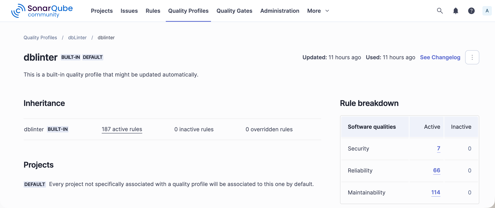

A quality profile defines the set of rules that will be applied during the analysis process.

## Built-in Profile

dbLinter's provided profile has enabled all rules.
As you manage the enabled rules and their parameters within the dbLinter repository, there is no need to maintain custom profiles.

