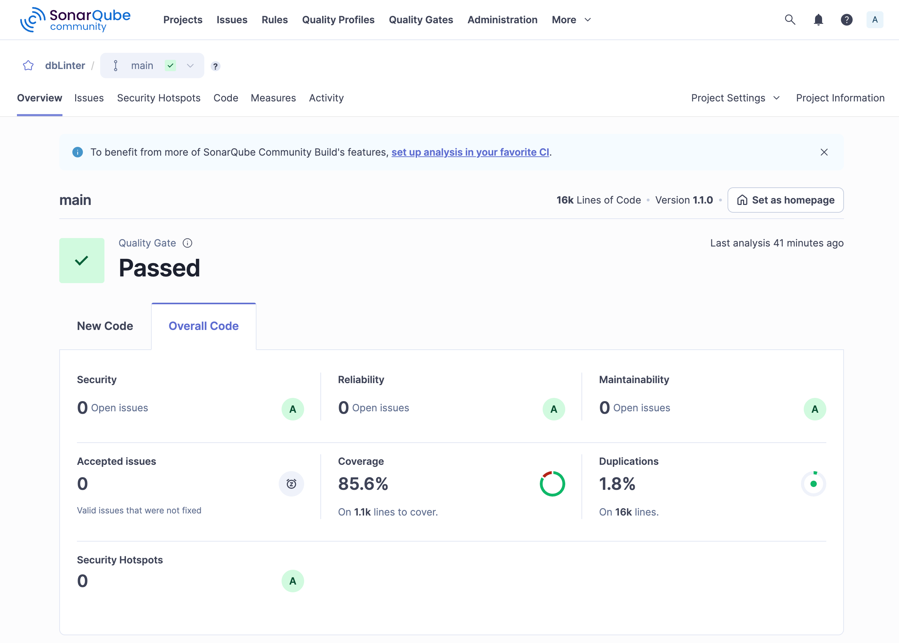
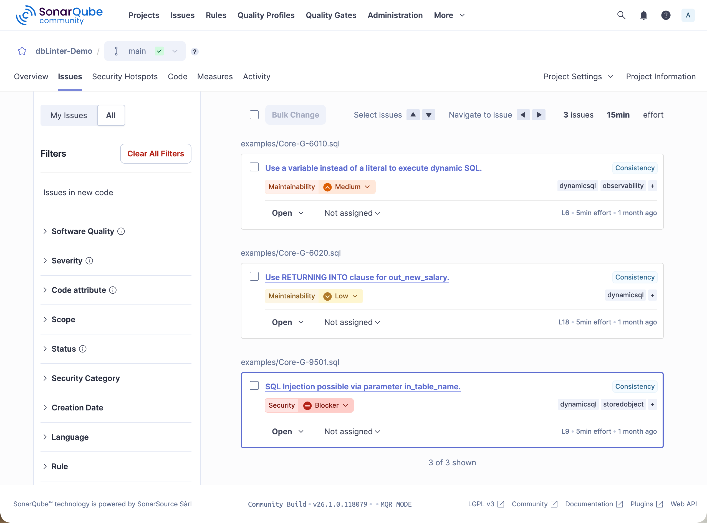
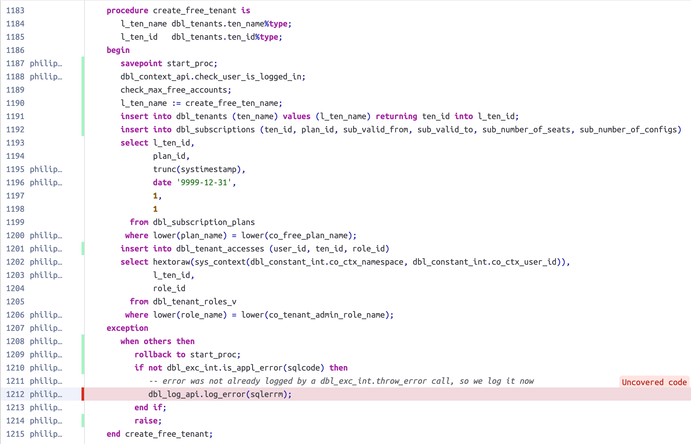
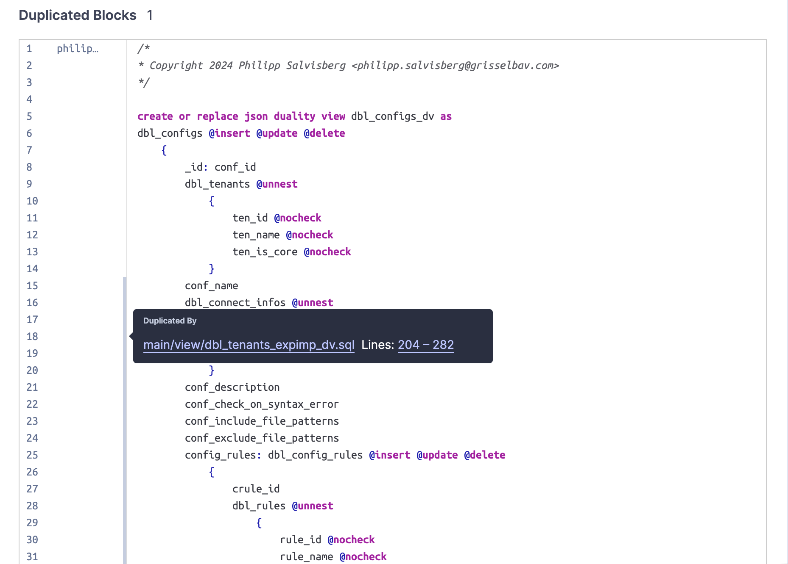

The results of an analysis run using SonarScanner are sent to the SonarQube server and made available on the web interface.

Here we show some examples of projects specific results.

## Dashboard

The dashboard in the `Overview tab` shows result either for [new code](https://docs.sonarsource.com/sonarqube-community-build/user-guide/about-new-code#focus-on-new-code) or all code.

## Issues

The `Issues` tab displays all rule violations in a project.
These results can be filtered by various criteria.
In this case, the filter is set to the tag `dynamicsql`.

Clicking on `SQL injection possible via parameter in_table_name.` shows the following detail screen.
The violation of rule G-9501 is shown on line 9, where an assertion is missing.
Furthermore, the related lines are highlighted.
Line 4 shows the unasserted parameter.
Line 11 shows the statement that is vulnerable to SQL injection.

## Code Coverage

The SonarQube plugin registers executable lines for database objects that can be tested with [utPLSQL](https://www.utplsql.org/utPLSQL/latest/userguide/coverage.html).
These are package bodies, type bodies, triggers, standalone functions, and standalone procedures.
It is important to note that the line numbers in the file must match the line numbers of the database objects stored in the database.

Furthermore, only the first line of an executable statement is marked as such.
This matches the behaviour of the PL/SQL profiler and the `DBMS_PLSQL_CODE_COVERAGE` package, which are used behind the scenes to record the covered code.

Here's an example of how covered and uncovered lines are visualised in SonarQube.
Covered lines are marked with a green bar on the left, while uncovered lines are marked with a red bar.

## Duplicated Code Blocks

The SonarQube plugin registers all the relevant tokens in the analysed files.
A token is considered relevant if it is visible to the parser.
Based on this information, SonarQube can detect duplicate code blocks.
A duplicate code block contains at least 100 identical tokens that are spread across at least 10 lines.

The following example shows how duplicate code blocks are visualised in SonarQube.

