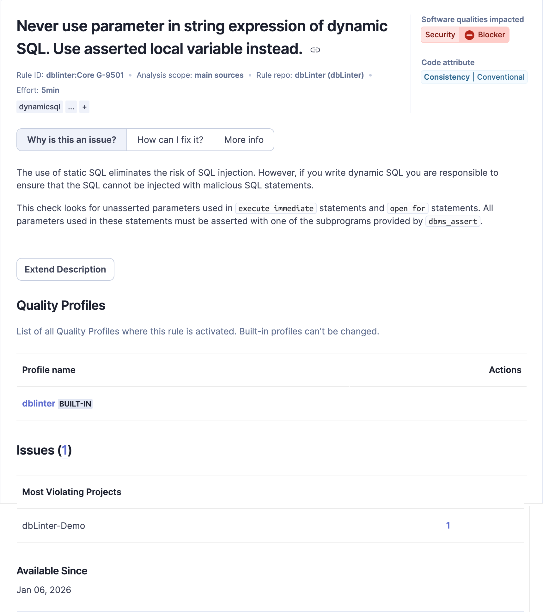
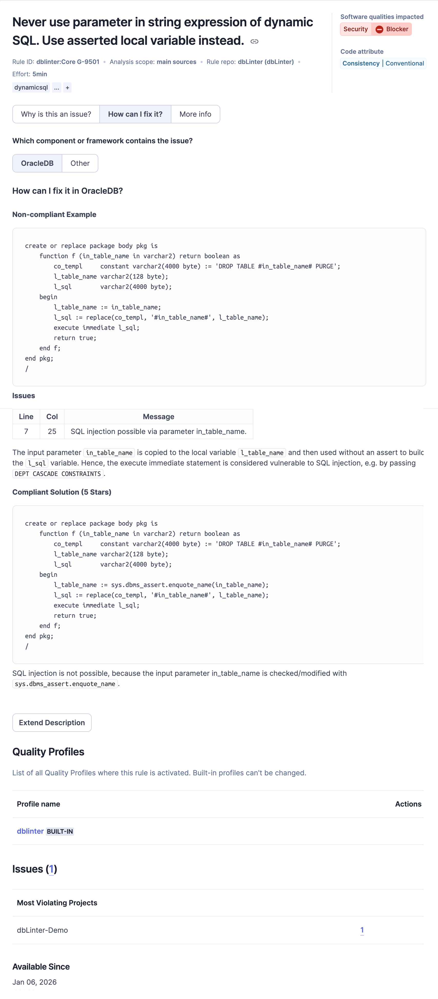
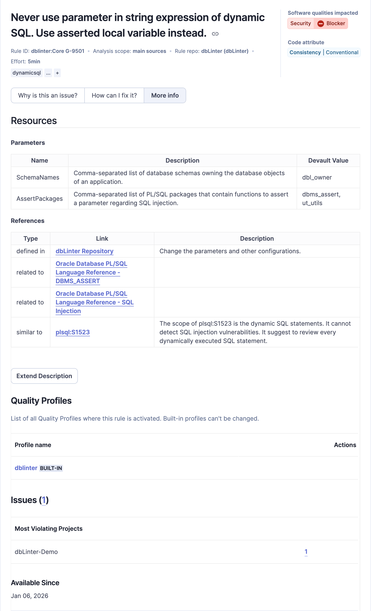

The rules are copied from the dbLinter repository when the dbLinter SonarQube plugin is installed or updated.

SonarQube then visualises them in three sections.

## Why is this an issue?

The reason of the rule is stored in this section.

## How can I fix it?

## More Info

