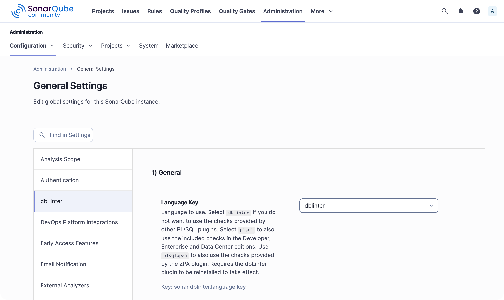
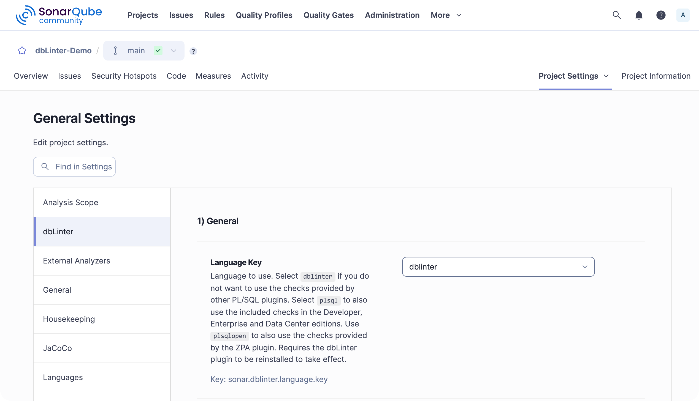

## Scope

The dbLinter settings in SonarQube have a global scope and a project scope.
This means that global settings can be overridden at project level via the SonarQube web interface and via property file or paramters for SonarScanner runs.

import { Tabs, TabItem } from '@astrojs/starlight/components';

<Tabs>
<TabItem label="Global">
Administration -> Configuration -> General Settings -> dbLinter


</TabItem>
<TabItem label="Project">
Projects -> "Project" -> Project Settings -> General Settings -> dbLinter


</TabItem>
<TabItem label="Property">
Example in `sonar-project.properties` to override global/project setting:

```
sonar.dblinter.access.token=IGsLxJQLnfZPFAkbMCaJntBjIaKtmYSOjnYiRTIlfYJYRggZgG
```
</TabItem>
<TabItem label="Parameter">
Example as parameter of `sonar-scanner` call to override global/project/property file setting:

```
-Dsonar.dblinter.access.token=IGsLxJQLnfZPFAkbMCaJntBjIaKtmYSOjnYiRTIlfYJYRggZgG
```
</TabItem>
</Tabs>

## 1) General

- **Language Key** `sonar.dblinter.language.key`<br/>
    Language to use.
    - Select `dblinter` if you do not want to use the checks provided by other PL/SQL plugins.
      In other words, use dbLinter as primary plugin.
    - Select `plsql` to also use the included checks in the Developer, Enterprise and Data Center editions.
    - Use `plsqlopen` to also use the checks provided by the ZPA plugin.

    Requires the dbLinter plugin to be reinstalled to take effect.

- **File Suffixes** `sonar.dblinter.file.suffixes`<br/>
    List of file suffixes containing code to be analysed with dbLinter.
    These file extensions are only relevant for the `dblinter` language key.
    Set the file suffixes for other languages in the associated plugins.
    This filter is applied before the include and exclude file patterns of a configuration.
    Use a comma separated list when defined as property or parameter.

## 2) Remote Access

- **Repo URL** `sonar.dblinter.repo.url`<br/>
    This is the URL of the dbLinter REST API. The default is https://api.dblinter.app/.
    You only need to set this URL when developing and testing custom rules.

- **Tenant Name** `sonar.dblinter.tenant.name`<br/>
    dbLinter tenant for authentication.
    SonarScanner uses this for checks, while the SonarQube server uses it to register all applicable rules when the plugin is installed.

- **User Name** `sonar.dblinter.user.name`<br/>
    dbLinter user (e-mail address) for authentication.
    SonarScanner uses this for checks, while the SonarQube server uses it to register all applicable rules when the plugin is installed.

- **Access Token** `sonar.dblinter.access.token`<br/>
    dbLinter access token for authentication.
    SonarScanner uses this for checks, while the SonarQube server uses it to register all applicable rules when the plugin is installed.

- **Config Name** `sonar.dblinter.config.name`<br/>
    Name of the dbLinter configuration for checks.
    SonarScanner uses this for checks.
    This configuration determines which rules are enabled and, consequently, checked.
    Therefore, you should ensure that all rules are enabled in the active quality profiles.

## 3) Read-only DB Access

Read-only access is recommended to achieve the best check results.

To enable read-only access, you will need to create a database user with the following permissions:

```sql
create user if not exists dbl_read identified by "(...)";
grant connect to dbl_read;
grant select any dictionary to dbl_read;
```

- **JDBC URL** `sonar.dblinter.conn.jdbc.url`<br/>
    Override JDBC URL for read-only database access within checks.
    E.g. jdbc:oracle:thin:@localhost:1521/FREEPDB1 or jdbc:postgresql://localhost:5432/postgres.
    The default is configured in the dbLinter repository.

- **Username** `sonar.dblinter.conn.user.name`<br/>
    Override username for read-only database access within checks.
    The default is configured in the dbLinter repository.

- **Password** `sonar.dblinter.conn.password`<br/>
    Override connection password for read-only database access within checks.
    The default is configured in the dbLinter repository.

## 4) Language Server

- **Parallel Files** `sonar.dblinter.ls.parallel.files`<br/>
    Number of files analysed in parallel when using the command line interface.
    The default is 1.
    To achieve better performance with higher values, you need enough free system resources.

- **Clear Cache Threshold** `sonar.dblinter.ls.clear.cache.threshold`<br/>
    Memory threshold in megabytes.
    This clears the ANTLR caches once the heap size used by the language server exceeds the threshold.
    This frees memory, but subsequent parsing is slower.
    Set the threshold to a value below zero to keep the cache.
    Leave empty for default behaviour.

- **Log Format** `sonar.dblinter.ls.log.format`<br/>
    Log format for log messages.
    Log messages from the language server will only be displayed if the `sonar.log.level` property is set to `DEBUG` or `TRACE`.
