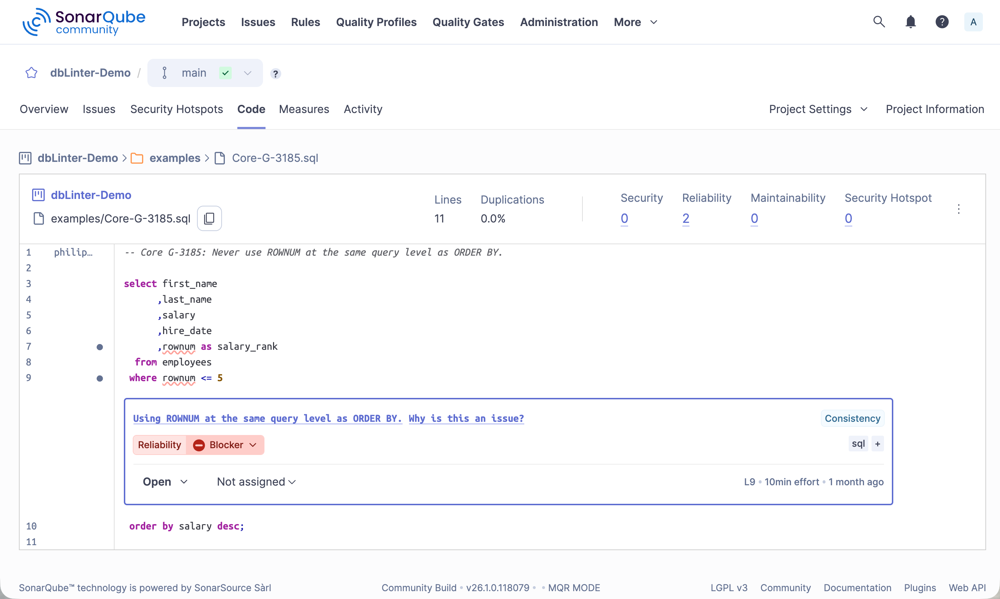

The dbLinter SonarQube plugin is used by the [SonarQube Scanner](https://docs.sonarsource.com/sonarqube-server/analyzing-source-code/scanners/sonarscanner)
to analyse code and show the results on the SonarQube Server web application.

The plugin can be installed in the free [SonarQube Community Build](https://www.sonarsource.com/open-source-editions/sonarqube-community-edition/)
as well as in any commercial self-managed [SonarQube Server](https://www.sonarsource.com/products/sonarqube/server/) edition.

The minimal SonarQube version is 9.9 and the minimal JDK version is 17.
See [documentation](https://docs.sonarsource.com/sonarqube-community-build/server-installation) for installing the SonarQube Community Build.

Releases of the dbLinter SonarQube plugin are published in the [Releases](https://github.com/Grisselbav/dbLinter/releases) section of the dbLinter GitHub repository.

## Install/Update Plugin

import { Steps } from '@astrojs/starlight/components';

<Steps>
1. Download `dblinter-sonarqube-x.y.z.jar` from https://github.com/Grisselbav/dbLinter/releases
2. Copy `dblinter-sonarqube-x.y.z.jar` to `$SONARQUBE_HOME/extensions/downloads`
3. Restart the SonarQube server
</Steps>

## Install Custom Rules

The initial installation registered all Core rules.
To register your custom rules, please follow these steps:

<Steps>
1. Login as SonarQube Administrator
2. Open Adminstration -> Configuration -> General Settings -> dbLinter
3. Define `Tenant Name`, `User Name` and `Access Token`
4. Delete `dblinter-sonarqube-x.y.z.jar` in `$SONARQUBE_HOME/extensions`
5. Restart the SonarQube server
6. Copy `dblinter-sonarqube-x.y.z.jar` to `$SONARQUBE_HOME/extensions/downloads`
7. Restart the SonarQube server
</Steps>

## Update Rules

Rules are only registered in SonarQube during plugin installation.
To update the rules, you need to reinstall the plugin.

<Steps>
1. Delete `dblinter-sonarqube-x.y.z.jar` in `$SONARQUBE_HOME/extensions`
2. Restart the SonarQube server
3. Copy `dblinter-sonarqube-x.y.z.jar` to `$SONARQUBE_HOME/extensions/downloads`
4. Restart the SonarQube server
</Steps>

## Use dbLinter as Secondary Plugin

By default, the dbLinter SonarQube plugin is registered as the primary plugin.
This means that the plugin is solely responsible for analysing SQL, PL/SQL and PL/pgSQL code.
However, if you want to use the ZPA plugin alongside dbLinter in the Community Build of SonarQube, or the built-in PL/SQL plugin in the Developer, Enterprise, or Data Center editions, you need to configure dbLinter as the secondary plugin.

<Steps>
1. Login as SonarQube Administrator
2. Open Adminstration -> Configuration -> dbLinter
3. For the Community Build, set the `Language Key` to `plsqlopen` for the ZPA plugin, or to `plsql` for the built-in PL/SQL plugin of commercial, self-managed editions of SonarQube.
4. Delete `dblinter-sonarqube-x.y.z.jar` in `$SONARQUBE_HOME/extensions`
5. Restart the SonarQube server
6. Copy `dblinter-sonarqube-x.y.z.jar` to `$SONARQUBE_HOME/extensions/downloads`
7. Restart the SonarQube server
</Steps>

When dbLinter is configured as a secondary plug-in, the primary plug-in is responsible for calculating the following metrics:

- Lines of Code
- Number of Comment Lines
- Number of Statements
- Number of Functions
- Cyclomatic complexity
- Code highlighting support through registration of keywords, symbols, strings, numbers, preprocessor directives and comments
- Copy & paste detection support through registration of relevant (visible) tokens
- Test coverage support through registration of executable lines

dbLinter only registers rule violations as a secondary plugin.

Furthermore, it is important to note that the primary plugin is responsible for defining which file suffixes to process.

## Example

