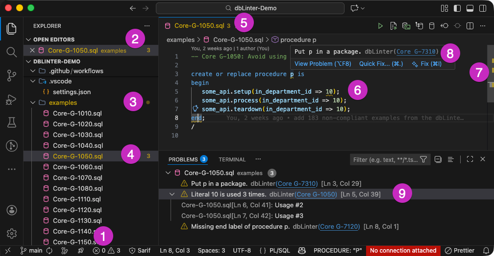

You can think of checks as being similar to a spellchecker.
Rather than looking for grammatical errors, however, they identify violations of the coding standards
that are defined as [rules](https://dblinter.app) in the dbLinter repository.

## Activation

dbLinter checks are activated as soon as you open a file associated with a supported language ID.

The following table shows the languages that activate dbLinter checks.

| Name      | ID | Extension | Default file extensions |
| --------- | -- | ----------| ----------------------- |
| IslandSQL | `islandsql` | [IslandSQL](https://marketplace.visualstudio.com/items?itemName=phsalvisberg.islandsql) | `.isql` |
| SQL       | `sql` | [sql (embedded)](https://github.com/microsoft/vscode/tree/main/extensions/sql) | `.sql`, `.dsql` |
|           |       | [PostgreSQL](https://marketplace.visualstudio.com/items?itemName=ms-ossdata.vscode-pgsql) | `.sql` |
| PL/SQL    | <code style="white-space: nowrap">oracle-sql</code> | [Oracle SQL Developer Extension for VSCode](https://marketplace.visualstudio.com/items?itemName=Oracle.sql-developer) | `.sql`, `.plsql`, `.klr`, `.pkb`, `.pkh`, `.pks`, `.plb`, `.pls` |
| PLSQL     | `plsql` | [Language PL/SQL](https://marketplace.visualstudio.com/items?itemName=xyz.plsql-language) | `.sql` `.ddl` `.dml` `.pkh` `.pks` `.pkb` `.pck` `.pls` `.plb` `.bdy` `.fnc` `.idx` `.mv` `.prc` `.prg` `.sch` `.seq` `.spc` `.syn` `.tab` `.tbl` `.tbp` `.tps` `.trg` `.typ` `.vw` |
| Postgres  | `postgres` | [PostgreSQL](https://marketplace.visualstudio.com/items?itemName=ckolkman.vscode-postgres) | `.pgsql`, `.psql` |
| Markdown  | `markdown` | [Markdown (embedded)](https://github.com/microsoft/vscode/blob/main/extensions/markdown-basics) | `.md`, `.mkd`, `.mdwn`, `.mdown`, `.markdown`, `.markdn`, `.mdtxt`, `.mdtext`, `.workbook` |
| APEXlang  | `apexlang` | [Oracle SQL Developer Extension for VSCode](https://marketplace.visualstudio.com/items?itemName=Oracle.sql-developer) | `.apex` |

A given language ID can be supported by an unlimited number of VS Code extensions. However, dbLinter will only activate for the language IDs listed above.

Default file extensions only apply if they have not been overridden or extended by a user- or workspace-level setting for the `files.associations` property.

Only [fenced code blocks](https://github.github.com/gfm/#fenced-code-blocks) are checked for Markdown and APEXlang. Code blocks marked for a non-SQL languages or using `~~~` will be ignored.

## Scope & Configuration

When dbLinter checks are activated for a file, its content is sent to the language server when the file is first opened, and then each time a change is made.

Whether or not a check is performed depends on the configuration,
especially the included/excluded [file patterns](https://grisselbav.github.io/dbLinter/tools/web-gui/configurations/#includeexclude-file-patterns)
and the [enabled rules](https://grisselbav.github.io/dbLinter/tools/web-gui/configurations/#rules).

Please note that dbLinter for VS Code only analyses the content of open editors.
As soon as a file is closed in VS Code, any related problems are also removed.
Use the [integrated CLI](/dbLinter/tools/cli/cli-overview/) to analyse an entire workspace.

## Check Results (Problems)

The dbLinter language server sends the results of the checks to VS Code, where they are displayed in various locations.

It's important to note that Visual Studio Code is visualising the results. dbLinter only provides the data.

import { Steps } from '@astrojs/starlight/components';

<Steps>
1. **Status Bar Summary** 
   The status bar provides a summary of the total number of errors and warnings.
   You can click on the summary to display the `PROBLEMS` panel.

2. **Open Editors Indicators** 
   The open file names are displayed in the colour corresponding to the most severe problem. The total number of problems is shown on the right.

3. **Workspace Folder Indicators** 
   The colour of the folder name indicates the most severe problem. A bullet of the same colour is displayed on the right.

4. **Workspace File Indicators** 
   The colour of the file name indicates the most severe problem.  The total number of problems is displayed on the right.

5. **Editor Tab Indicators** 
   The colour of the file name indicates the most severe problem.  The total number of problems is displayed to the right of the file name.

6. **Inline Squiggles** 
   The problems are displayed alongside the text in the editor.
   The relevant positions are underlined with wavy lines in colours that indicate the severity of the problem.

   Currently, there is a limitation of around 500 highlighted problems in the editor.
   Therefore, the absence of squiggles does not necessarily mean that there are no more problems.
   Please refer to [GitHub Issue 200206](https://github.com/microsoft/vscode/issues/200206) for the latest status update.

7. **Ruler Indicators** 
   The ruler on the right side of the editor indicates problems in the colour of the severity of the problem.

8. **Hoover Tooltips** 
   Hovering over an inline squiggle will display a tooltip with various details about the problem.
   - The `View Problem` link provides alternative way of navigating through problems.
   - The `Quick Fix` link opens a pop-up window with quick fix options.
   - The `Fix` link prompts the configured AI agent to suggest a solution.
   - A link to the coding rule is provided after the problem description.
     In this example, the link is to [Core G-7310](https://dblinter.app/ords/r/dblinter/dblinter-console/rules#P1000_SHOW_RULE=core%20g-7310).  

9. **Problems Panel** 
   The problems panel displays all problems for each file.
   Either in hierarchical or in tablular view.
   You can also filter problems by severity or other criteria.
   - Click on a problem to navigate to its location in the editor.
   - Click on the light bulb at the start of a problem to open a pop-up window containing quick-fix options. The light bulb is only shown for the active problem or when you hover over it with the mouse.
   - Click on the link to the rule name, e.g. [Core-1050](https://dblinter.app/ords/r/dblinter/dblinter-console/rules#P1000_SHOW_RULE=core%20g-1050), to open the rule description in your default browser.

   Only the hierarchical view shows related problems.
   These list locations in the code that are related to a problem but are not highlighted with inline squiggles.
   In this example, it shows the other usages of the literal `10` in the code.
</Steps>
