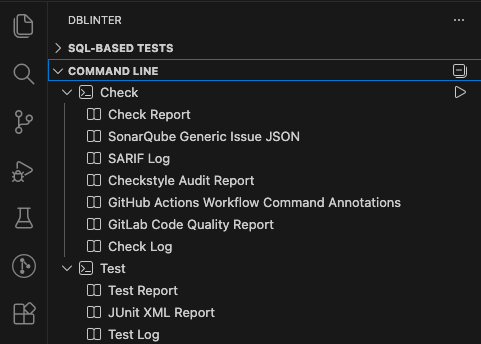
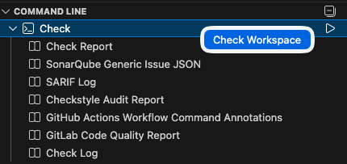
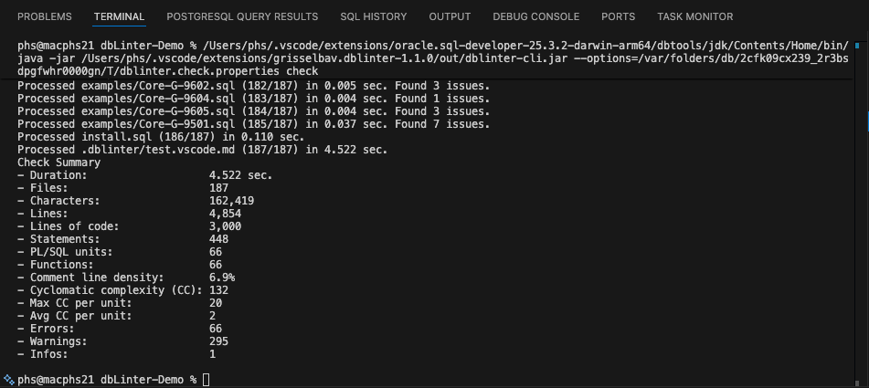
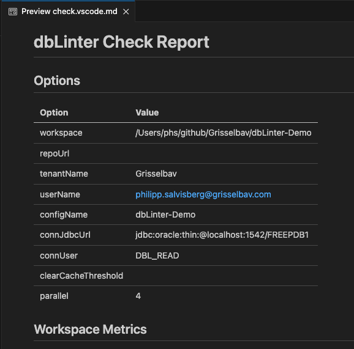
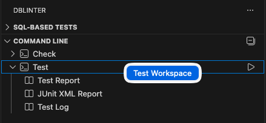
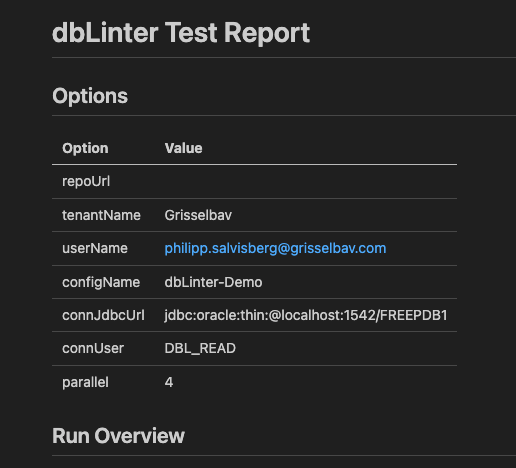

The CLI is bundled with the VS Code extensions.
The `check` and the `test` commands can be run directly from the UI, eliminating the need for manual input.
This feature is only available with an [Essential](/dbLinter/getting-started/essential-subscription/)
or [Professional Subscription](/dbLinter/getting-started/professional-subscription/).

## Activation

The CLI integration is activated either when you run a check or when you open the dbLinter view container.

Clicking on the dbLinter symbol

in the activity bar opens the dbLinter view container. `Command Line` is the second view in this container.

## Check

To check all the files in the workspace, right-click on `Check` in the view and select `Check Workspace`.
Alternatively, click the run button to the right of the top-level entry `Check`.

This action opens a terminal window and runs the `check` command inside it.

Once the `check` command has been completed, the `Check Report` is opened.

The following outputs are produced and accessible in the `Command Line` view.

| Output Name | File Name in .dblinter | Description |
| ----------- | ---------------------- | ----------- |
| Check Report | check.vscode.md | dbLinter Check Report as Markdown. |
| SonarQube Generic Issue JSON | check.sonarqube.json| [SonarQube](https://docs.sonarsource.com/sonarqube-server/2025.1/analyzing-source-code/importing-external-issues/generic-issue-import-format/) Generic formatted issue report to import issues in any SonarQube edition without any plugin. |
| SARIF Log | check.sarif.sarif | Static Analysis Results Interchange Format ([SARIF](https://docs.oasis-open.org/sarif/sarif/v2.1.0/errata01/os/sarif-v2.1.0-errata01-os-complete.html)) to visualise issues in various tools. See also [Viewers](https://sarifweb.azurewebsites.net/#Viewers). |
| Checkstyle Audit Report | check.checkstyle.xml | [Checkstyle](https://github.com/linkedin/pygradle/blob/master/pygradle-plugin/src/test/resources/checkstyle/checkstyle.xsd) XML report. |
| GitHub Actions Workflow Command Annotations | check.github.txt | [Workflow commands for GitHub Actions](https://docs.github.com/en/actions/reference/workflows-and-actions/workflow-commands). These commands (annotations) are interpreted when printed to stdout. |
| GitLab Code Quality Report | check.gitlab.json | [GitLab](https://docs.gitlab.com/ci/testing/code_quality/#code-quality-report-format) quality report. |
| Check Log | check.log | The dbLinter log file. |

## Test

To run all SQL-based tests, right-click on `Test` in the view and select `Test Workspace`.

This action opens a terminal window and runs the `test` command inside it.

Once the `test` command has been completed, the `Test Report` is opened.

The following outputs are produced and accessible in the `Command Line` view.

| Output Name | File Name in .dblinter | Description |
| ----------- | ---------------------- | ----------- |
| Test Report | test.vscode.md | dbLinter Test Report as Markdown. |
| JUnit XML Report | test.junit.xml | [JUnit](https://llg.cubic.org/docs/junit/) XML Report. |
| Test Log | test.log | The dbLinter log file. |
