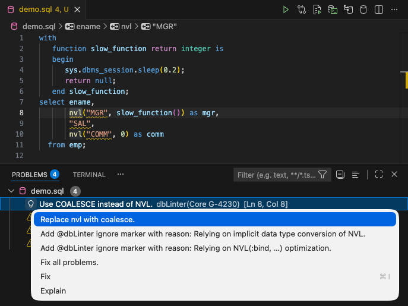
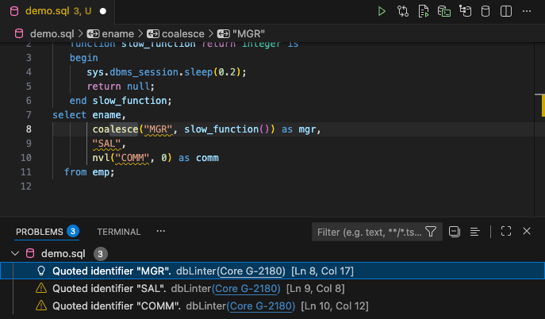
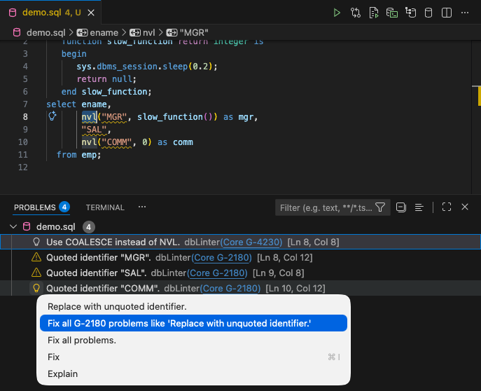
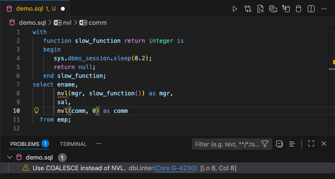
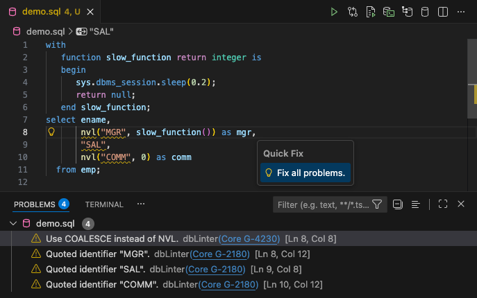
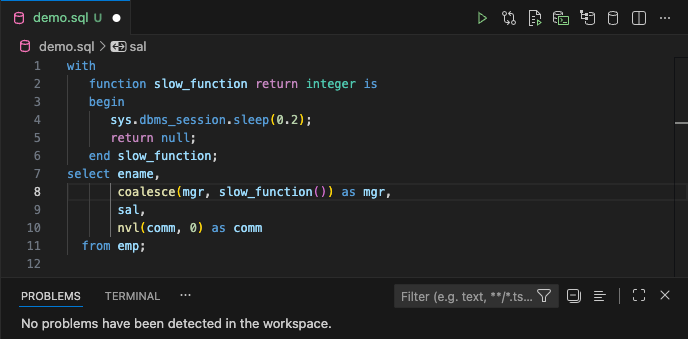
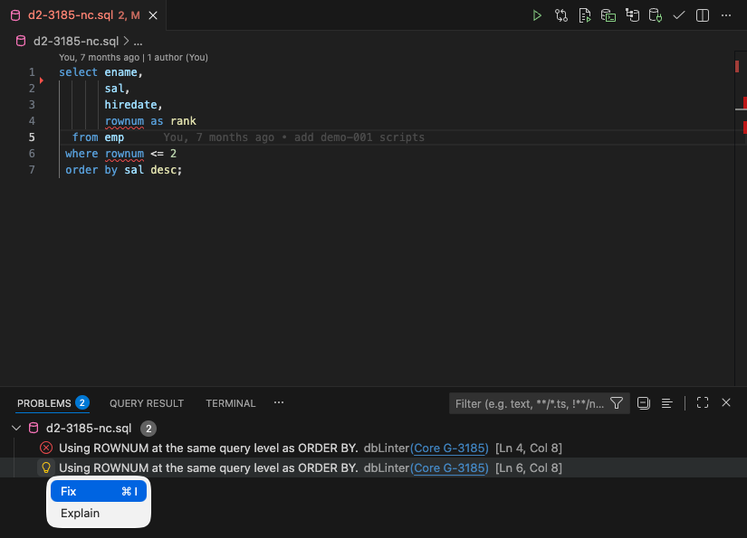
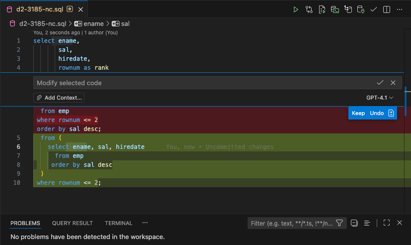
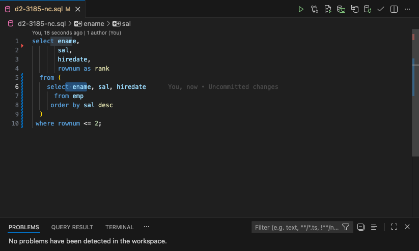

Quick fixes are context-aware suggestions for resolving problems reported by dbLinter, eliminating the need to search for solutions manually.

## Single Problem

The first three options in the quick fix pop-up window are solutions to the problem on line 8, column 8.



The `Replace nvl with coalesce.` option produces the following result:



## All Problems of One Rule

Rather than fixing one problem at a time, you can select the option `Fix all <rule> problems like ...` to fix all problems for one rule in one go.

This option is only available if multiple problems have been reported for a rule in a file.



The `Fix all G-2180 problems like 'Replace with unquoted identifier.'` option produces the following result:



## Fix All Problems

From the quick fix pop-up window, you can select the `Fix all problems` option.
This option is available in every editor position if there are any quick fixes that can be safely applied to the file.



The `Fix all problems.` option produces the following result:



## @dbLinter Ignore Marker Comment

If you are unable to fix a problem or choose not to, you can add a `@dbLinter ignore` marker to indicate that the problem is being intentionally accepted.
This avoids making unnecessary or unsafe changes and keeps the linting output meaningful rather than noisy.

### Syntax

The @dbLinter maker comment must be placed within a single-line or multiline comment, and is case-insensitive.

```text
@DBLINTER IGNORE(rule1 [, rule2]...) [comment]
```

The syntax of a rule is as follows:

```text
[tenantName] ruleName
```

If you omit the `tenantName`, the `ruleName` is expected to exist in the `Core` tenant.

### Scope

If the dbLinter marker comment is not the first token on a line, the scope is limited to that line only.

If the dbLinter marker comment is the first token on a line, the scope is determined by the most inner IslandSQL parser rule context that fully contains the comment.
The following IslandSQL parser rules are considered:

- [statement](https://islandsql.github.io/IslandSQL/grammar.html#statement)
- [functionDefinition](https://islandsql.github.io/IslandSQL/grammar.html#functionDefinition)
- [procedureDefinition](https://islandsql.github.io/IslandSQL/grammar.html#procedureDefinition)
- [constructorDeclaration](https://islandsql.github.io/IslandSQL/grammar.html#constructorDeclaration)
- [funcDeclInType](https://islandsql.github.io/IslandSQL/grammar.html#funcDeclInType)
- [procDeclInType](https://islandsql.github.io/IslandSQL/grammar.html#procDeclInType)

If the dbLinter marker comment is placed before the first token recognised by the IslandSQL parser, the scope is the whole file.

### Examples

The scope of the dbLinter marker comment is visualised using highlighted lines in the examples below.

```sql {6} title="Scope: Single-Line"
declare
   l_var1 integer;
   procedure proc1 is
      l_var2 integer;
      procedure proc2 is
         l_var3 integer; -- @dbLinter ignore(G-1030)
         l_var4 integer;
      begin
         null;
      end;
   begin
      proc2;
   end;
begin
   proc1;
end;
/
```

```sql {5-11} title="Scope: Procedure proc2"
declare
   l_var1 integer;
   procedure proc1 is
      l_var2 integer;
      procedure proc2 is
         -- @dbLinter ignore(G-1030, G-7120)
         l_var3 integer;
         l_var4 integer;
      begin
         null;
      end;
   begin
      proc2;
   end;
begin
   proc1;
end;
/
```

```sql {3-14} title="Scope: Procedure proc1"
declare
   l_var1 integer;
   procedure proc1 is
      -- @dbLinter ignore(G-1030, G-7120)
      l_var2 integer;
      procedure proc2 is
         l_var3 integer;
         l_var4 integer;
      begin
         null;
      end;
   begin
      proc2;
   end;
begin
   proc1;
end;
/
```

```sql {1-17} title="Scope: Anonymous PL/SQL Block"
declare
   -- @dbLinter ignore(G-1030, G-7120)
   l_var1 integer;
   procedure proc1 is
      l_var2 integer;
      procedure proc2 is
         l_var3 integer;
         l_var4 integer;
      begin
         null;
      end;
   begin
      proc2;
   end;
begin
   proc1;
end;
/
```

```sql {1-18} title="Scope: File"
-- @dbLinter ignore(G-1030, G-7120)
declare
   l_var1 integer;
   procedure proc1 is
      l_var2 integer;
      procedure proc2 is
         l_var3 integer;
         l_var4 integer;
      begin
         null;
      end;
   begin
      proc2;
   end;
begin
   proc1;
end;
/
```

## AI Fixes

The screenshot in [Single Problem](#single-problem) shows the two options, `Fix` and `Explain`, provided by the Copilot extension in VS Code.
If you have set up an AI agent in VS Code, you will also have access to these options in your installation.

The next screenshot shows a violation of rule [G-3185: Never use ROWNUM at the same query level as ORDER BY](https://dblinter.app/ords/r/dblinter/dblinter-console/rules#P1000_SHOW_RULE=core%20g-3185).
In this case, dbLinter does not provide a quick fix. However, the AI agent can suggest code fixes based on the information it receives.
In other words, the context. For example, this is:

- The content in the editor.
- The name and description of the violated rule.
- The exact position of the rule violation in the editor.
- Additional information about this rule available on the internet.



In this case, the AI agent is Copilot, which is configured to use the GPT-4.1 model.
The following code change is proposed:



After accepting the proposal, the editor content looks similar to the following:



The code violation has now been resolved, meaning the query produces the correct result.

However, you cannot be sure that the result is correct.
Why? Because the result is not deterministic.
Even with this simple example, we have experienced different results in the past.
Some were correct and some were wrong. Therefore, you should always check the result produced by the AI agent.

In any case, the provided solution is not the best option.
A modern solution would use the [row_limiting_clause](https://docs.oracle.com/en/database/oracle/oracle-database/26/sqlrf/SELECT.html#GUID-CFA006CA-6FF1-4972-821E-6996142A51C6__BABBADDD), which was introduced with the Oracle Database 12c.
as shown in the second solution of [G-3185](https://dblinter.app/ords/r/dblinter/dblinter-console/rules#P1000_SHOW_RULE=core%20g-3185).

That said, the fixes proposed by the AI agent are powerful and useful when a dbLinter quick fix is unavailable.
