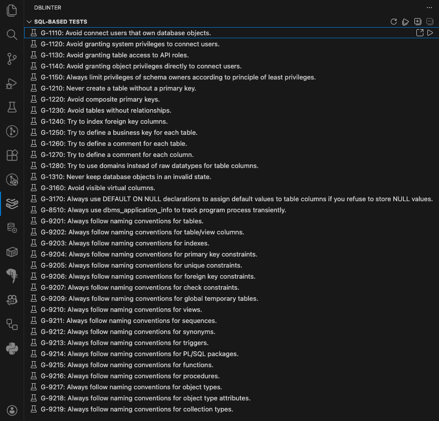
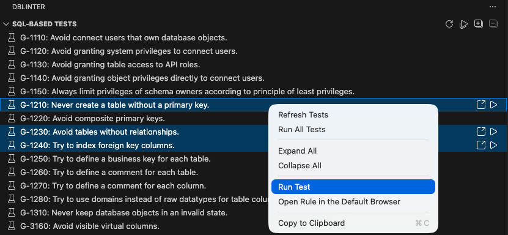
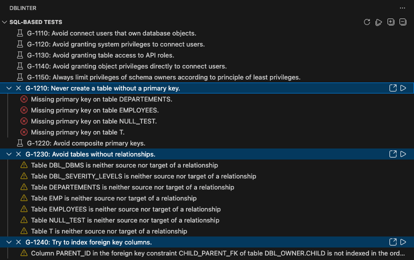
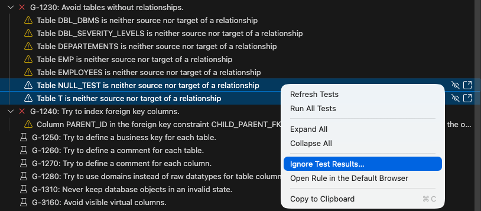
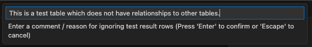
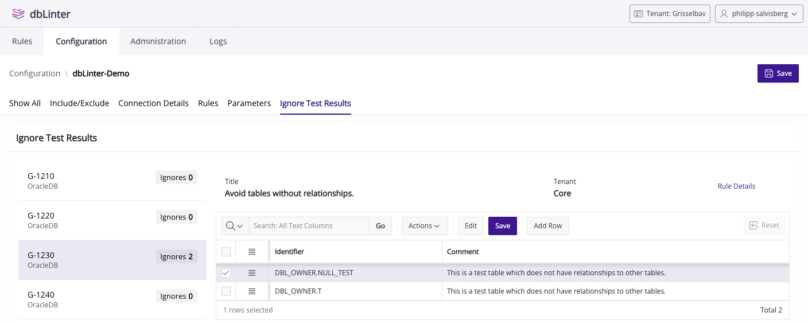
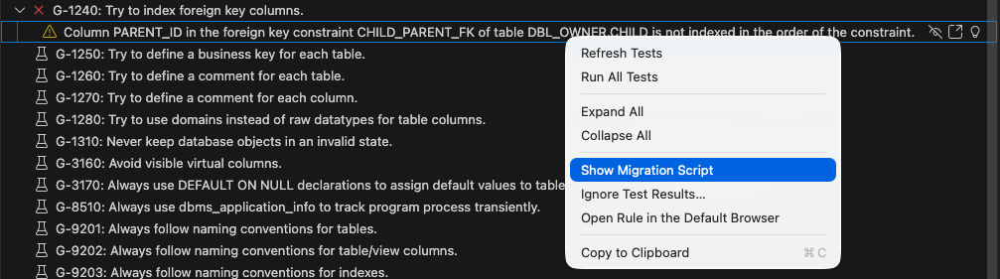
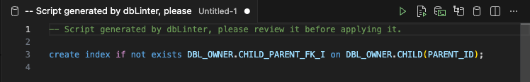

Compliance with the rules in the dbLinter repository can be verified using checks, SQL-based tests, or both.
In a SQL-based test, an SQL query is run against a non-production database via a configured read-only connection.
The returned rows are treated as violations of the rule.
Optionally, each return row may contain a migration script to fix the violation.

## Prerequisites

In order to run SQL-based tests, you must first configure [read-only access](/dbLinter/tools/vscode/settings/#read-only-access).

## Applicability

Whether a SQL-based test is shown in the VS Code extension depends on the following:

1. Is the rule enabled in the configuration?
2. Does the database version fall within the minimal and maximal ranges defined in the rule?

The SQL-based test is only considered applicable if both questions can be answered with 'yes'.

## Activation

The applicable SQL-based tests are determined when a check is activated or when you open the dbLinter view container.
The dbLinter view container is the dbLinter symbol

on the activity bar. `SQL-based Tests` is the first view in this container.

## Run Tests

To run all tests, right-click anywhere in the view and select `Run All Tests`.
To run selected tests, right-click on one of the selected tests and select the `Run Test` option.
Alternatively, click the run button to the right of each test.

The found rule violations are visualised as children in the tree.

## Ignore Test Results

If you are unable to resolve a rule violation reported by an SQL-based test, or if you choose not to, you can ignore selected test results.
This ensures that the rule violations will not appear in subsequent test runs.

To perform this action, your access token must have either the `Configurator` or `Tenant-Admin` role.

After selecting the test results to be ignored, you must provide a reason why these results should be excluded from future runs.

You can manage the test results to be ignored in the Web GUI.

## Migration Scripts

If the SQL-based test produces a migration script, you can show it in a new editor tab.

The following migration script is shown in this case:

The SQL-based test for [G-1240: Try to index foreign key columns](https://dblinter.app/ords/r/dblinter/dblinter-console/rules#P1000_SHOW_RULE=core%20g-1240) uses the [IF NOT EXISTS](https://docs.oracle.com/en/database/oracle/oracle-database/26/sqlrf/CREATE-INDEX.html#GUID-1F89BBC0-825F-4215-AF71-7588E31D8BFE__GUID-9F542E6F-CC27-40D6-BC54-487C44E68844) clause only if applicable to the used database version.

