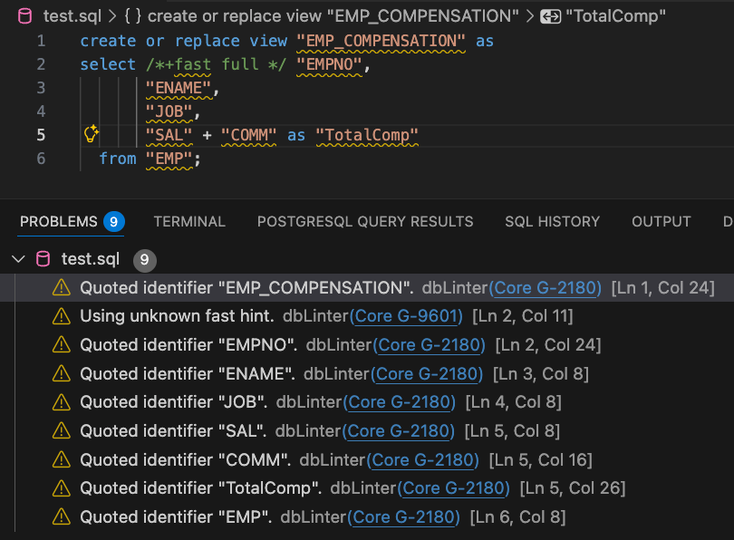
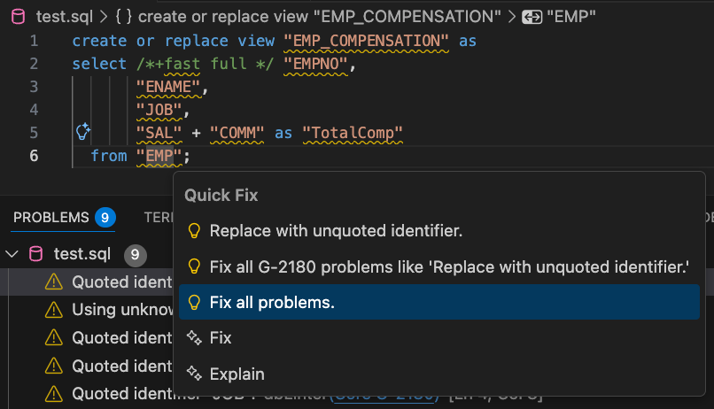
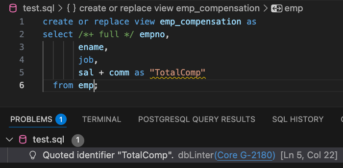
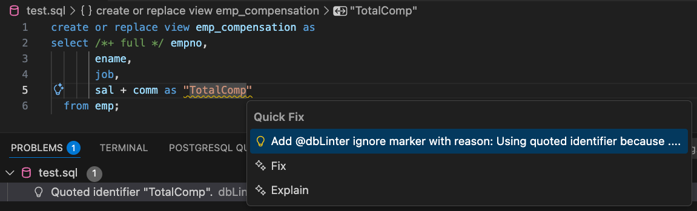
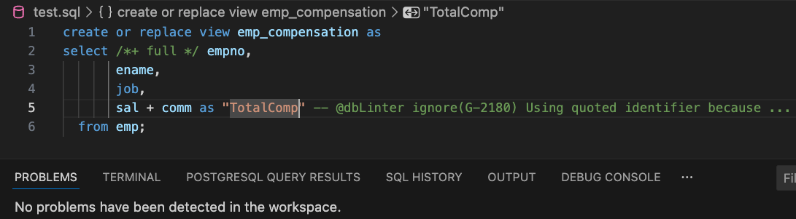
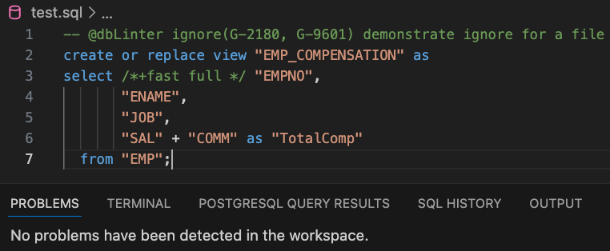
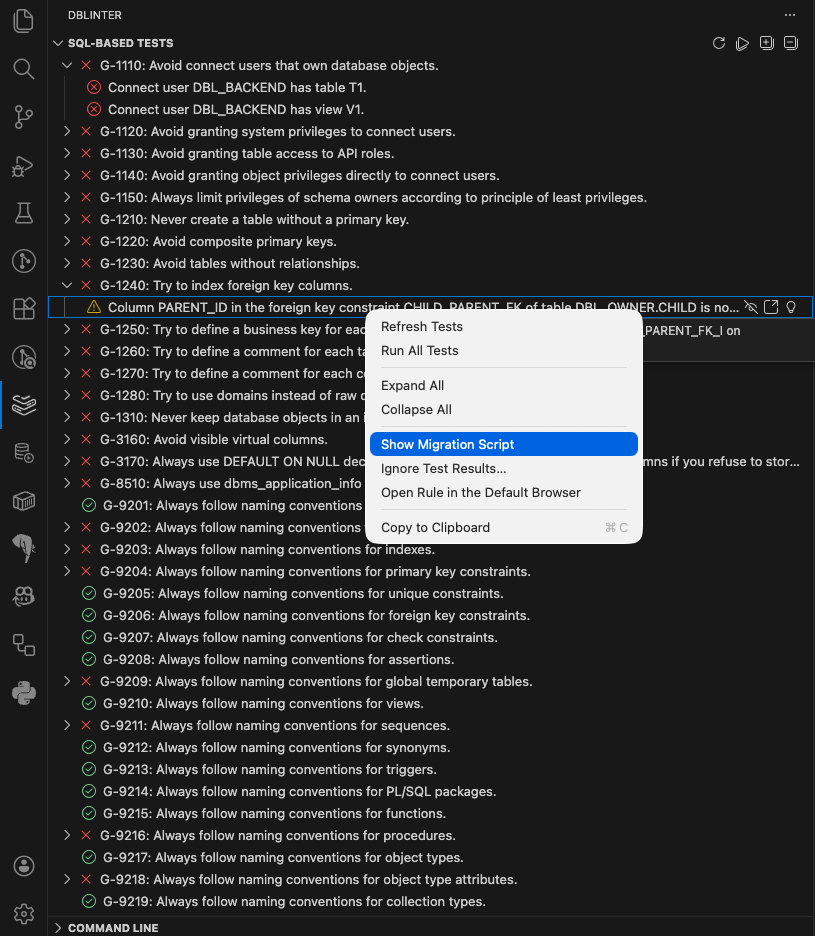
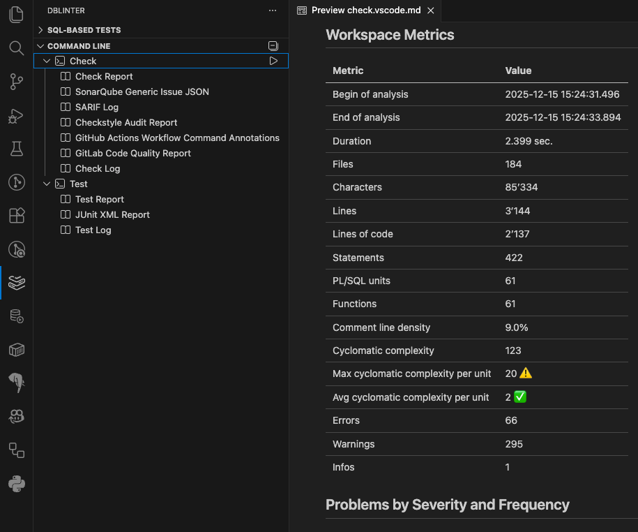

The dbLinter VS Code Extension provides rule violations and quick fixes for given URIs via the included language server.
It further can run SQL-based tests and CLI commands.

The extension can be installed in any IDE that implement the [Visual Studio Code Extension API](https://code.visualstudio.com/api),
such as [Visual Studio Code](https://code.visualstudio.com/), [VSCodium](https://vscodium.com/), [Cursor](https://cursor.com/), [Windsurf](https://windsurf.com/editor),
[Antigravity](https://antigravity.google/) and [Theia IDE](https://theia-ide.org/#theiaide).

Releases of the dbLinter VS Code extensions are published in the [Visual Studio Marketplace](https://marketplace.visualstudio.com/items?itemName=Grisselbav.dblinter) and the [Open VSX Registry](https://open-vsx.org/extension/Grisselbav/dblinter).

## Installation

import { Steps, Tabs, TabItem } from '@astrojs/starlight/components';

<Tabs>
<TabItem label="via VS Code Marketplace">
<Steps>
1. Open VS Code
2. Go to Extensions
3. Search for "dbLinter"
4. Click Install
</Steps>
</TabItem>
<TabItem label="via Open VSX Registry">
<Steps>
1. Open VSCodium, Cursor, Windsurf, Antigravity or Theia IDE
2. Go to Extensions
3. Search for "dbLinter"
4. Click Install
</Steps>
</TabItem>
</Tabs>

## Settings

The default settings are for an anonymous subscription plan.
This means that only around 50 rules are active.
These are the free rules from the `Essential` and `Balanced` profiles.
Which is a reasonable set for any project.

To configure the set of rules to be applied, you need at least a free [Starter Subscription](/dbLinter/getting-started/starter-subscription/).

## Examples

### Checks

Available with an [Anonymous Subscription (Free)](/dbLinter/getting-started/anonymous-subscription/).

### Quick Fixes

Available with an [Essential Subscription](/dbLinter/getting-started/essential-subscription/).

### Ignore Issue

Available with an [Anonymous Subscription (Free)](/dbLinter/getting-started/anonymous-subscription/).

### Ignore Issues in File

Available with an [Anonymous Subscription (Free)](/dbLinter/getting-started/anonymous-subscription/).

### SQL-based Tests

Available with a [Starter Subscription (Free)](/dbLinter/getting-started/starter-subscription/).

### CLI Integration

Available with an [Essential Subscription](/dbLinter/getting-started/essential-subscription/).

