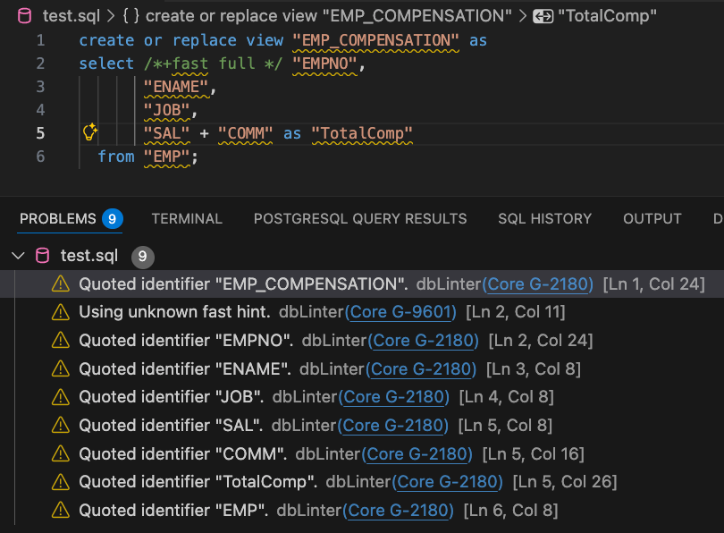
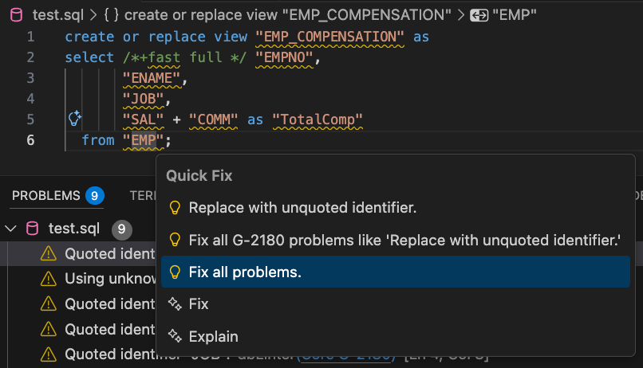
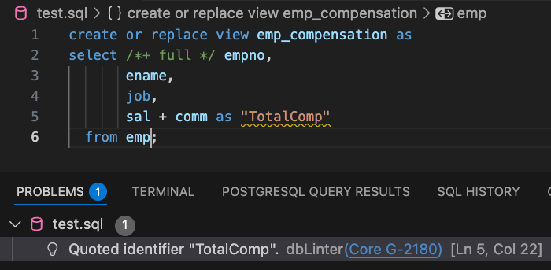
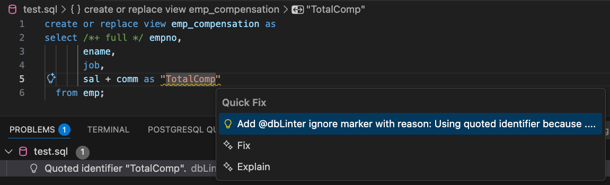
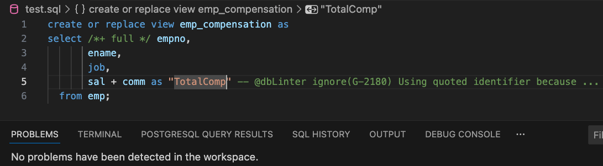
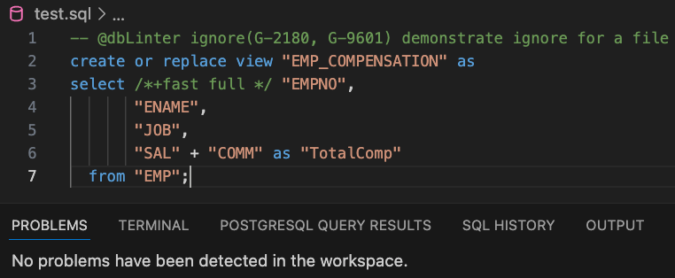
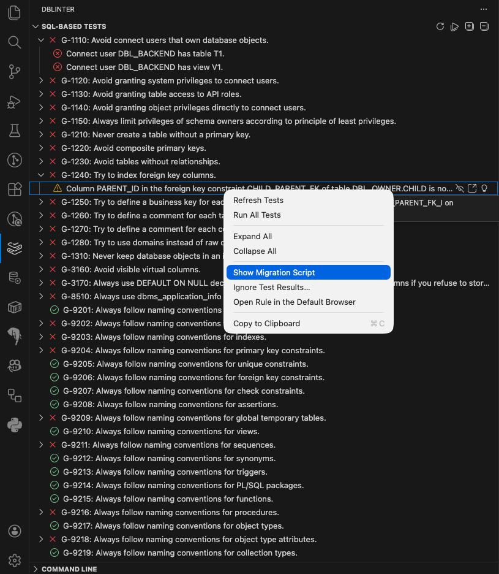
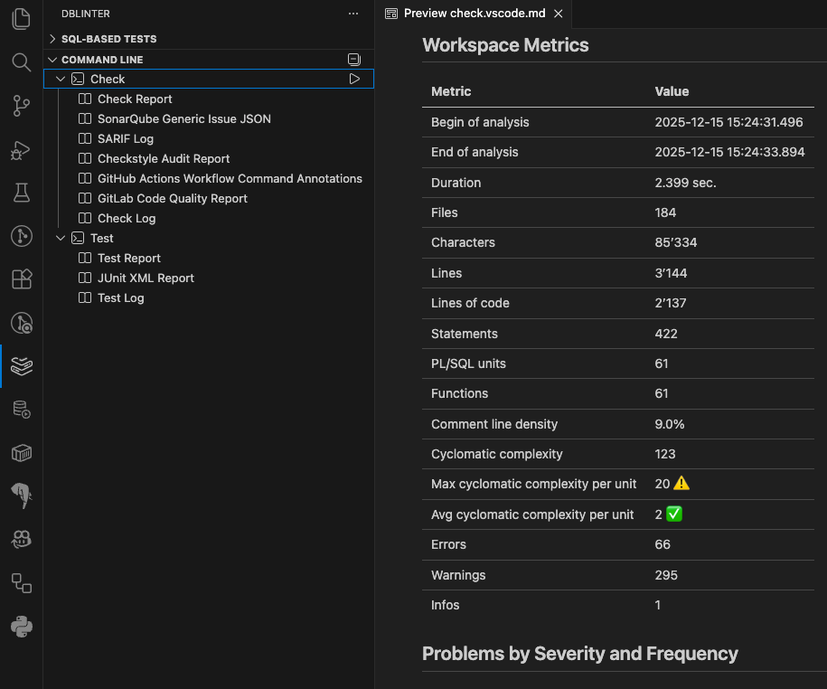

The dbLinter VS Code Extension provides rule violations and quick fixes for given URIs via the included language server.
It further can run SQL-based tests and CLI commands.

This extension can be installed in any IDE that implement the [Visual Studio Code Extension API](https://code.visualstudio.com/api).

The majority of these are IDEs based on [Code OSS](https://github.com/microsoft/vscode). An alternative to forking [Code OSS](https://github.com/microsoft/vscode) is to implement
the [Visual Studio Code Extension API](https://code.visualstudio.com/api) from scratch.

The list below shows IDEs that run locally on a developer's machine. These IDEs have been successfully tested with dbLinter.

| IDE | Based on [Code OSS](https://github.com/microsoft/vscode)? | First Release Date | Tested version |
| --- | :-------------------------------------------------------: | :----------------: | :------------: |
| [Visual Studio Code](https://code.visualstudio.com/) | yes | 2015-04 | 1.123.0 (2026-06-03) |
| [Theia IDE](https://theia-ide.org/#theiaide) | no | 2017-03 | 1.71.101 (2026-05-29) |
| [VSCodium](https://vscodium.com/) | yes | 2018-08 | 1.121.03429 (2026-05-19) |
| [Cursor](https://cursor.com/) | yes | 2023-03 | 3.6.31 (2026-05-31) |
| [Windsurf](https://windsurf.com/editor) | yes | 2024-11 | 2.3.15 (2026-05-27) [^Windsurf-EOL] |
| [Void](https://voideditor.com/) | yes | 2025-01 | 1.4.9 (2025-06-23) [^Void-EOL] |
| [Kiro](https://kiro.dev/) | yes | 2025-07 | 0.11.133 (2026-04-22) |
| [Antigravity IDE](https://antigravity.google/) | yes | 2025-11 | 2.0.4 (2026-06-02)
| [Neural Inverse](https://neuralinverse.com/) | yes | 2026-05 | 1.0.0 (2026-05-21)
| [Devin Desktop](https://devin.ai/desktop) | yes | 2026-06 | 3.0.31 (2026-06-04)

[^Windsurf-EOL]: Devin Desktop is the successor to Windsurf. Windsurf is now end of life.
[^Void-EOL]: Void is deprecated. The GitHub repository has been archived. The most prominent fork is Neural Inverse.

Releases of the dbLinter VS Code extensions are published in the [Visual Studio Marketplace](https://marketplace.visualstudio.com/items?itemName=Grisselbav.dblinter) and the [Open VSX Registry](https://open-vsx.org/extension/Grisselbav/dblinter).

## Installation

import { Steps, Tabs, TabItem } from '@astrojs/starlight/components';

<Tabs>
<TabItem label="via VS Code Marketplace">
<Steps>
1. Open VS Code
2. Go to Extensions
3. Search for "dbLinter"
4. Click Install
</Steps>
</TabItem>
<TabItem label="via Open VSX Registry">
<Steps>
1. Open IDE
2. Go to Extensions
3. Search for "dbLinter"
4. Click Install
</Steps>
</TabItem>
</Tabs>

## Settings

The default settings are for an anonymous subscription plan.
This means that only around 50 rules are active.
These are the free rules from the `Essential` and `Balanced` profiles.
Which is a reasonable set for any project using an Oracle Database.

To configure the set of rules to be applied, you need at least a [Starter Subscription (Free)](/dbLinter/getting-started/starter-subscription/).

## Examples

### Checks

Available with an [Anonymous Subscription (Free)](/dbLinter/getting-started/anonymous-subscription/).

### Quick Fixes

Available with an [Essential Subscription](/dbLinter/getting-started/essential-subscription/).

After applying `Fix all problems`:

### Ignore Issue

Available with an [Anonymous Subscription (Free)](/dbLinter/getting-started/anonymous-subscription/).

After adding the `@dbLinter ignore` marker comment:

### Ignore Issues in File

Available with an [Anonymous Subscription (Free)](/dbLinter/getting-started/anonymous-subscription/).

### SQL-based Tests

Available with a [Starter Subscription (Free)](/dbLinter/getting-started/starter-subscription/).

### CLI Integration

Available with an [Essential Subscription](/dbLinter/getting-started/essential-subscription/).

