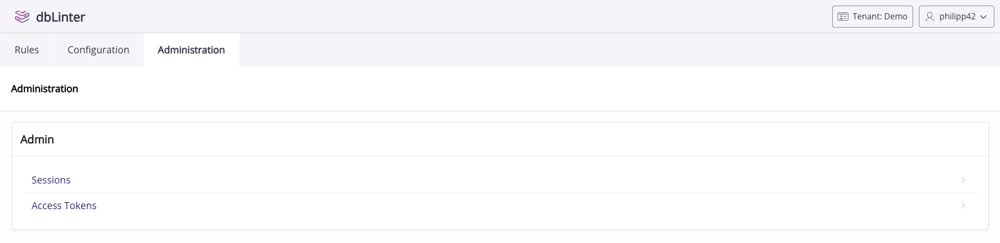
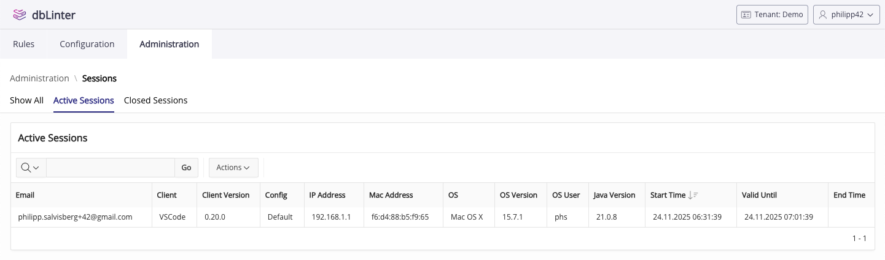
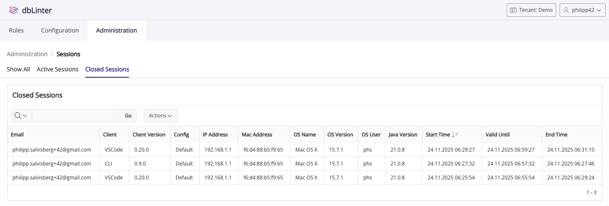
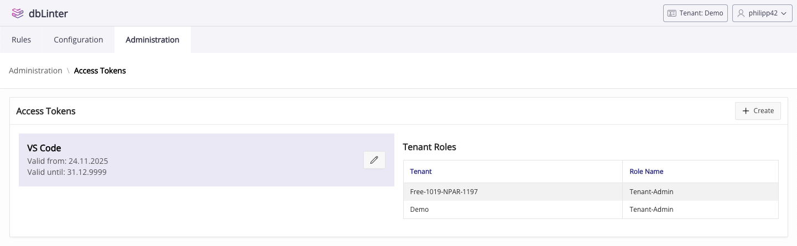
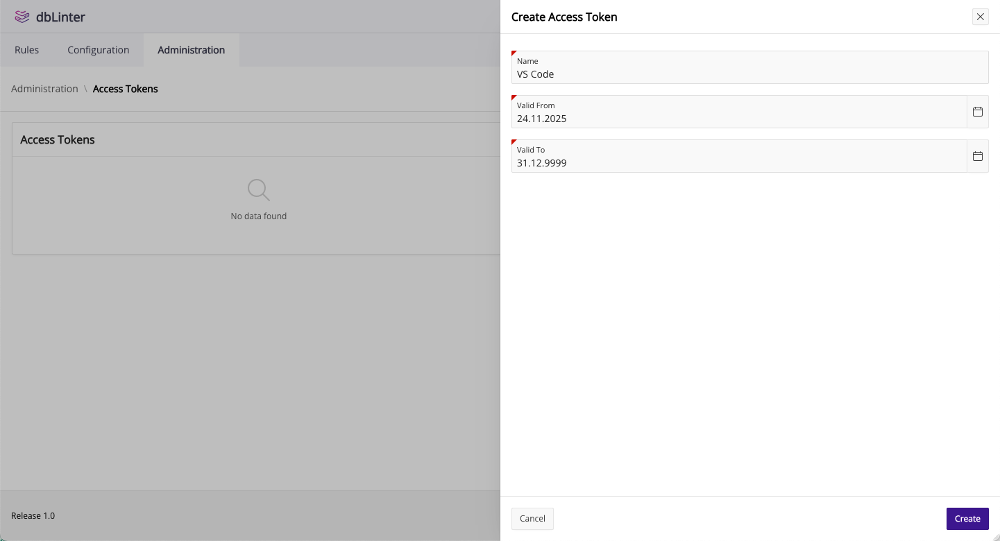
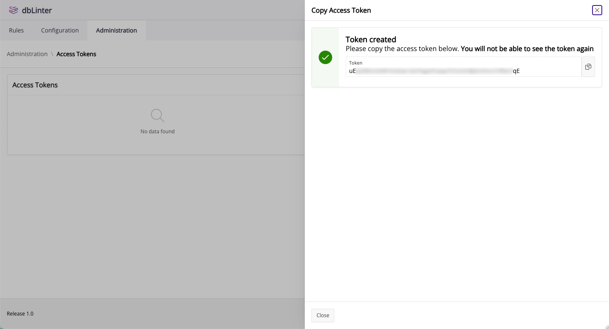

## Menu

The Administration menu provides two entries. `Sessions` and `Access Tokens`.

## Sessions

### Active Sessions

The `Active Sessions` section shows you all the sessions that are still open.
A session ends in the following cases:

- Shutdown of the Language Server
- Running `Reload Window` in VS Code (explicitly or implictly after updating extensions)
- Opening a subsequent session from VS Code (after 1800 seconds)
- Daily cleanup job that closes expired sessions

Active sessions are considered expired when the value of `Valid Until` is in the past.

The number of concurrent seats is calculated by looking at non-expired sessions of a tenant.

A seat is defined by the following attributes:

- `Email` (dbLinter user)
- `IP Address`
- `MAC Address`
- `OS User`

As the tenant administrator, you can see all of your tenant's sessions.
Other users can only see their own sessions.

### Closed Sessions

The `Closed Sessions` section shows you all the sessions that have been closed.
As a tenant administrator, you can use this data to better understand
the number of seats your tenant needs.

As the tenant administrator, you can see all of your tenant's sessions.
Other users can only see their own sessions.

## Access Tokens

### List

To use dbLinter from a client, like VS Code, CLI or SonarQube, you'll need a personal access token.
A personal access token consists of the following information (used as `ApiKey` in REST calls):

- `Tenant` (gives the context for a configuration)
- `Email` (the dbLinter user)
- `Token` (a generated secret, similar to a password)

You cannot use an access token to sign into the Web GUI. It's only valid in the client tools
using the internal REST API.

### Create Access Token

Press the `Create` button in the top right corner to create a new access token.

Give the access token a name and a validity period. The name is only used to tell the access tokens in the GUI apart.

Press the `Create` button to show the generated secret.

Copy the secret to your clipboard and save it in your password manager.
dbLinter only stores the token's hash key in its repository.
Therefore, you won't be able to see the secret again once you've closed the window.