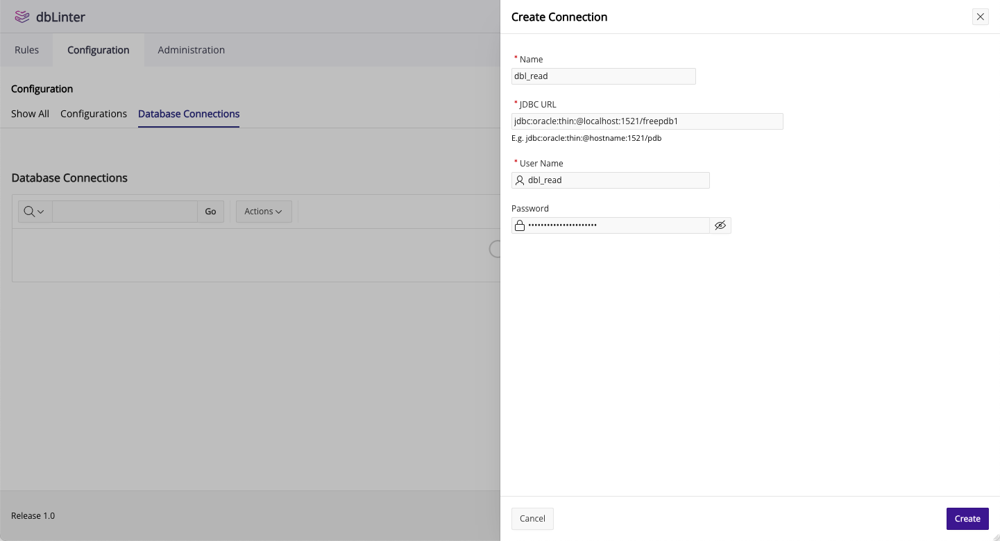
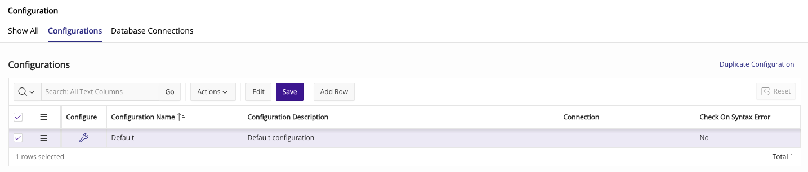
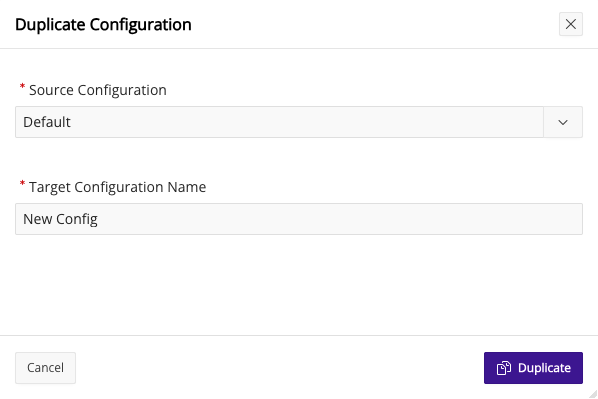
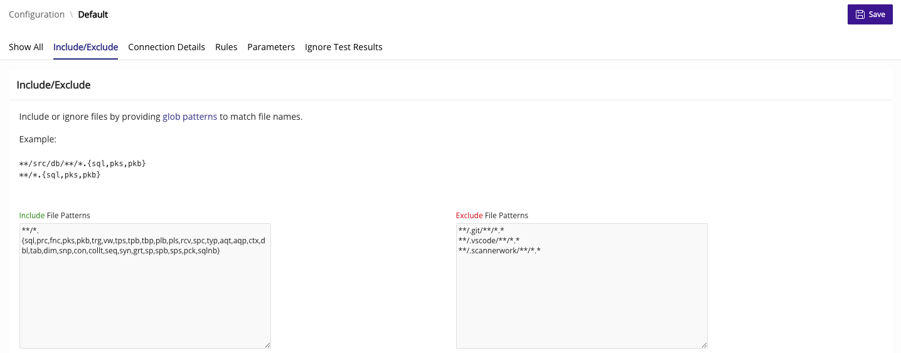
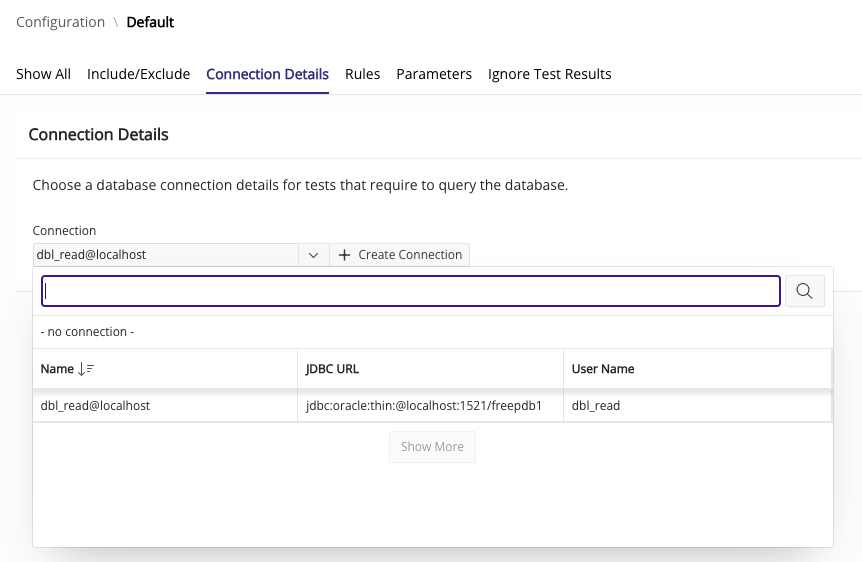
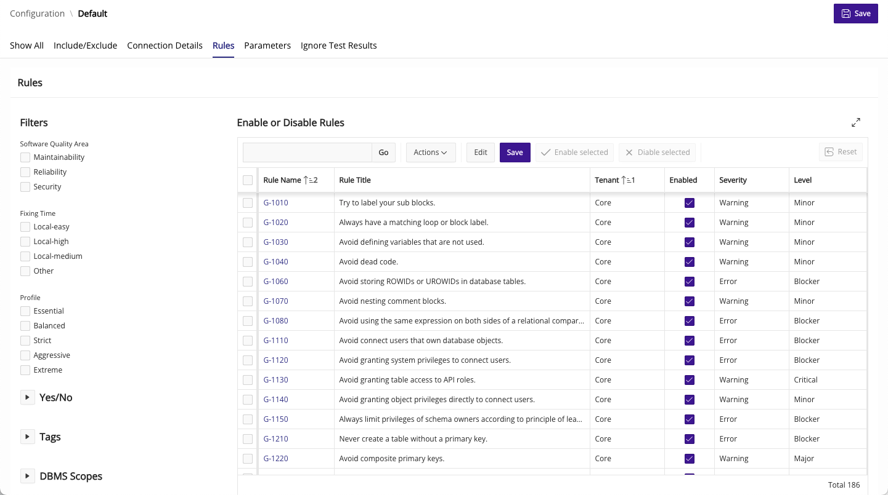
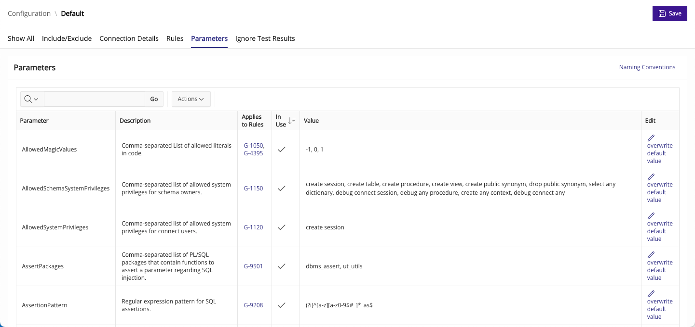
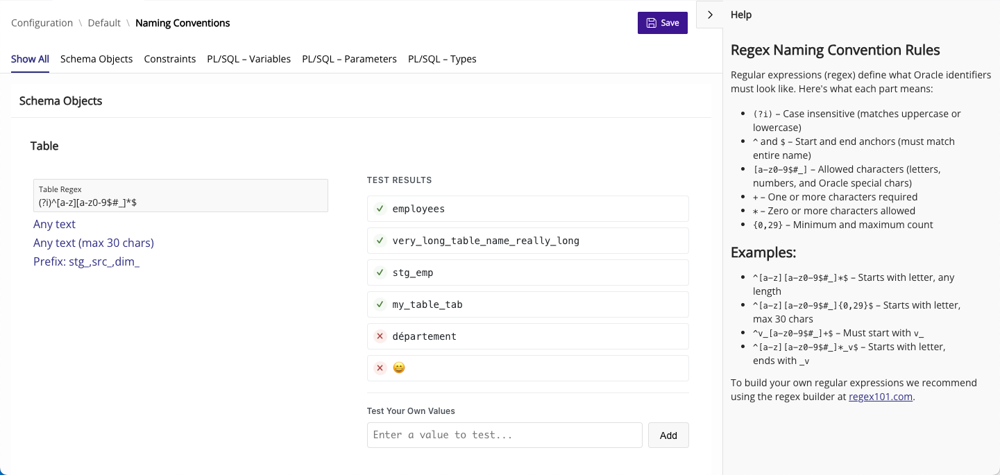
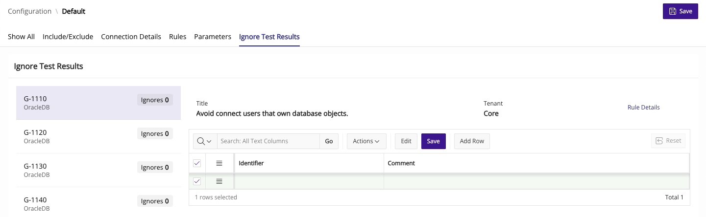

## Database Connections

As part of the configuration, you can optionally define a database connection.
To do this, you first need to create a database connection.



A database connection is required to execute SQL-based tests.
Furthermore, the database connection can be used optionionally in

- Checks, e.g. in [G-7120: Always add the name of the program unit to its end keyword](https://dblinter-rules.united-codes.com/rules/G-7120/)
to determine if the database version lets you add end labels to a `create type body` statement.
- Quick fixes, e.g. to determine the default format model in [G-9010: Always use a format model in string to date/time conversion functions](https://dblinter-rules.united-codes.com/rules/G-9010/).

The password is stored encrypted in the dbLinter backend. However, you can omit the password here and define it in the client.

The database user should not own any database objects. In this example the user `dbl_read` is created as follows:

```sql
create user if not exists dbl_read identified by "(...)";
grant connect to dbl_read;
grant select any dictionary to dbl_read;
```

## Configurations

### List

With a Starter subscription, you can only have one configuration.
All other subscriptions can have as many configurations as they want.



### Duplicate Configuration

If you have a configuration that just needs a few small changes for a project,
It's usually easier to copy the configuration and edit it rather than starting from scratch.

Go ahead and press the `Duplicate Configuration` button in the top right corner.



### Include/Exclude File Patterns

Press the 🔧 icon in the configure column to see the details of a configuration.
In the `Include/Exclude` section you can define the file patterns to include and exlude.

Each line matches a [glob pattern](https://docs.oracle.com/javase/tutorial/essential/io/fileOps.html#glob).
These patterns are used to match the URIs provided by the client.
These URIs are fully qualified, like the following examples:

```
file:///Users/user/project/some_file.sql
file:///c%3A/Users/user/project/some_file.sql
file:///c:/Users/user/project/some_file.sql
```

Therefore all patterns should start with `**/` unless you really want to specify fully qualified URIs.



### Connection Details

Here, you can select a database connection for the configuration.
A database connection is required to execute SQL-based tests.
Futhermore, it can improve the results of checks and quick fixes.



### Rules

In this section you can enable and disable rules. Furthermore for every enabled rule you can override the default

- Severity as used by VS Code (`Error`, `Warning`, `Info`, `Hint`);
- Severity level as used by SonarQube (`Blocker`, `Critical`, `Major`, `Minor`, `Info`).



Click on the rule name to see the Rule Details on the [Rules](/dbLinter/tools/web-gui/rules/#rule-details) page.

### Parameters

In this section you can configure the parameters used by dbLinter rules.

A parameter can be used by more than one rule.



### Naming Conventions

Click on the `Naming Conventions` button (top right corner) to open the page where
you can change and test the parameters related to naming conventions.



### Ignore Test Results

In this section you can managed the test results to be ignored.
Usually, you add new results to be ignored in VS Code after running SQL-based tests.
You can do that there for one or more test results and add a comment.

This page is used to update or delete existing test results that are to be ignored.
However, you can also add new tests to be ignored on this page.


