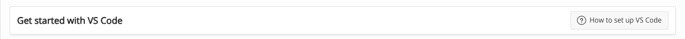
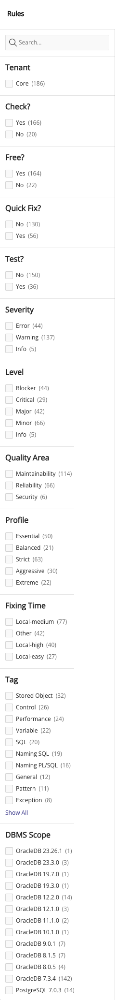
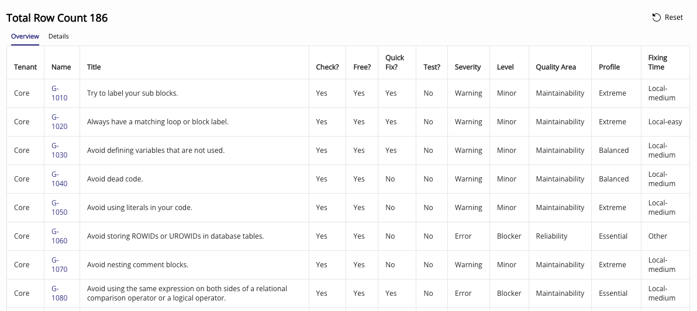
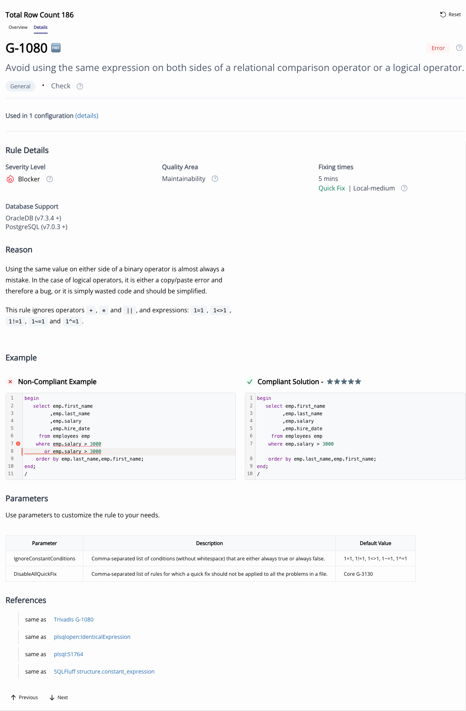
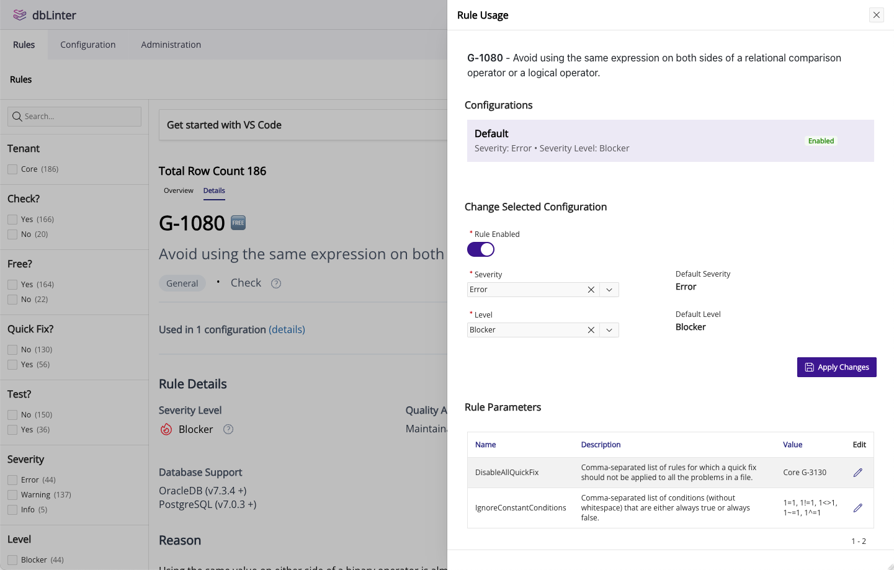

The rules page is the only public page. This means this page can be accessed without a dbLinter account.

This page shows the same content as the [Static Rule Site](https://dblinter-rules.united-codes.com/all-rules/).
However, the Static Rule Site shows only the public rules of the `Core` tenant. Tenant-specific rules are
only visible here and only if you are signed in.

## Get started with VS Code

When you are signed in, you will see this extra header.

Click on `How to set up VS Code` to find out how to set up VS Code to use your dbLinter account and its configuration.

## Search Criteria

In this page you can query rules by the following search criterias:

| Facet Group   | Description |
| ------------- | ----------- |
| Search box    | Case-insensitive search for a substring in the rule name or rule title. |
| Tenant        | The tenant the rule belongs to. The `Core` tenant contains all provided rules. |
| Check?        | Does the rule implement a check? |
| Free?         | Is the rule included in free Starter subscription? |
| Quick Fix?    | Does the rule implement a quick fix? |
| Test?         | Does the rule implement a SQL-based test? |
| Severity      | The severity of a rule as used by VS Code (`Error`, `Warning`, `Info`, `Hint`). |
| Level         | The severity level of a rule as used by SonarQube (`Blocker`, `Critical`, `Major`, `Minor`, `Info` ). |
| Quality Area? | The quality area of a rule as used by SonarQube (`Maintainability`, `Reliability`, `Security`). |
| Profile?      | Grouping according to importance, general applicability and controversy. |
| Fixing Time   | Time to fix a rule viloation (`Local-easy`, `Local-medium`, `Local-high`, `Other`). |
| Tag           | The tag a rule was given. |
| DBMS Scope    | The minimum version of a DBMS System this rule can be applied to. |

## Tabular Search Results

In the `Overview` tab, you can see a list of all the rules that match your search criteria. You can click on the rule name to show the details of a rule.

## Rule Details

In the `Details` tab, you see the details of one rule that match your search criteria.
In the second tab (details) you see a single rule.

You can use the buttons labelled `Previous` or `Next` to go through the rules.  You can also use the `p` and `n` keys to do the same thing.

## Enable/Disable Rule in Configuration

You can click on `(details)` to enable or disable the rule in a configuration,
change the severity, severity level and the parameters.

