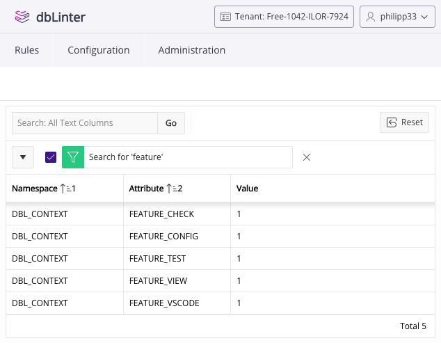

## Authentication

The following authentication method is currently supported:

| Method | Description |
| ------ | ----------- |
| dbLinter | Own authentication scheme based on email (username) and password. |

Additional authentication schemes are planned.

## Authorisation

### Features

dbLinter manages the following features:

| Feature    | Description |
| ---------- | ----------- |
| View       | View rules and related data. |
| Config     | Manage configurations. |
| Check      | Run checks. |
| Test       | Run SQL based tests. |
| VSCode     | Run checks and SQL-based tests in the dbLinter VS Code extension. |
| FullScope  | Run checks and SQL based tests for non-free rules in all clients. |
| QuickFix   | View and apply quick fixes in dbLinter VS Code extension. |
| CLI        | Run dbLinter CLI commands `check` and `test` for CI/CD and  SonarCloud integration. |
| Users      | Manage user access. |
| SonarQube  | Use dbLinter SonarQube plugin. |
| Rules      | Manage custom rules, checks and SQL based tests. |
| GenJava    | Generate Java project for checks and SQL based tests. |
| GenUtPLSQL | Generate utPLSQL PL/SQL package for SQL based tests. |
| Plugin     | Manage custom plugin for validator with checks. |
| Export     | Export rules and configurations. |
| Import     | Import rules and configurations. |
| Plan       | Manage subscription plans. Only available for product administrators. |

### Subscription Features

The range of features available depends on the dbLinter subscription plan selected.

| Subscription Plan | Features |
| ----------------- | -------- |
| Anonymous (Free)  | Check, VSCode |
| Starter (Free)    | View, Config, Check, Test, VSCode |
| Essential         | View, Config, Check, Test, VSCode, FullScope, QuickFix, CLI, Users |
| Professional      | View, Config, Check, Test, VSCode, FullScope, QuickFix, CLI, Users, SonarQube, Rules, GenJava, GenUtPLSQL, Plugin, Export, Import |

### Role Features

To simplify access management for users and access tokens, features are grouped into roles.

| Role            | Features |
| --------------- | -------- |
| Access-Request  | (none)1 |
| DB-Developer    | View, Check, Test, VSCode, FullScope, QuickFix, CLI |
| Configurator    | View, Config |
| Rules-Developer | View, Rules, GenJava, GenUtPLSQL, Plugin |
| Transporter     | View, Export, Import |
| Tenant-Admin    | View, Config, Check, Test, VSCode, FullScope, QuickFix, CLI, Users, SonarQube, Rules, GenJava, GenUtPLSQL, Plugin, Export, Import |

1 The Access-Request role is temporary. It is assigned when access to a tenant is requested.

### Applicability

The applicable roles are calculated at runtime according to the assigned roles and the active subscriptions of the selected tenant.
Features are only available if they are included in the active subscriptions.

This is why a user with the Tenant-Admin role of a free starter subscription only has access to the features included in that subscription.

### Session Info

To view the features currently enabled in your Web GUI session, click on the user symbol in the top-right corner and select `Session Info` from the pop-up menu.

