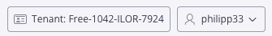
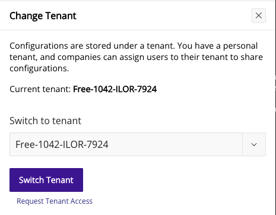
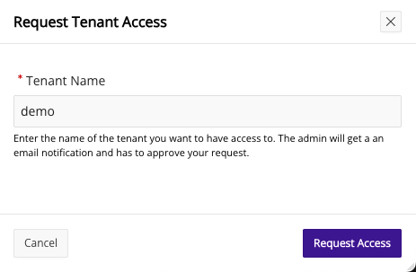
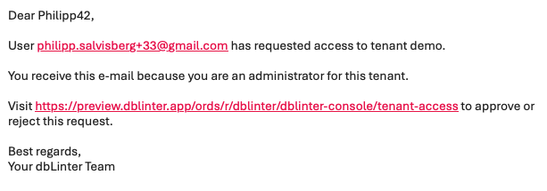
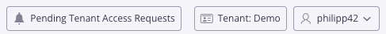
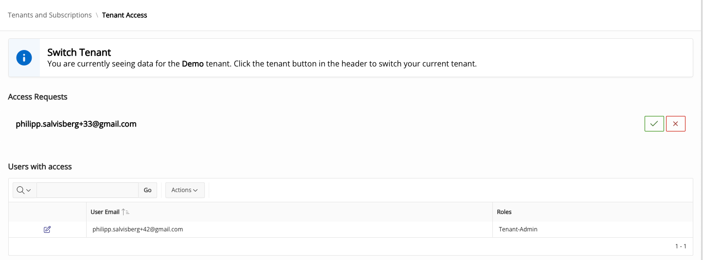
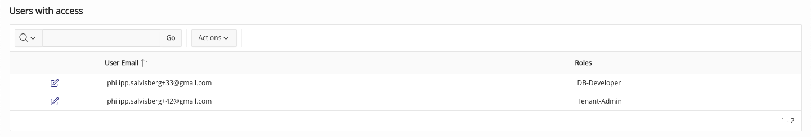
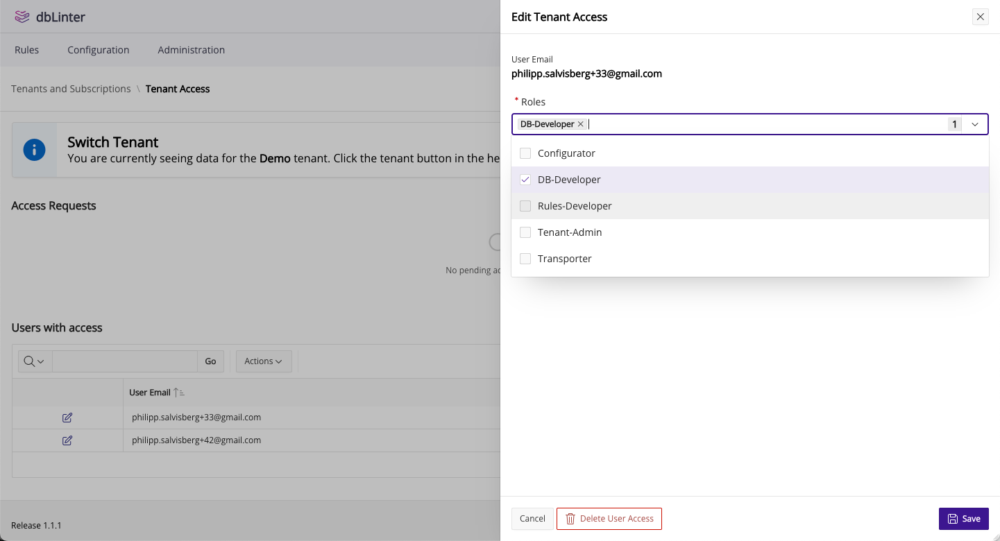
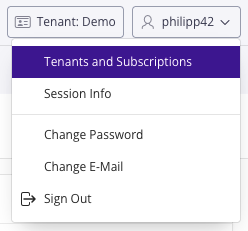
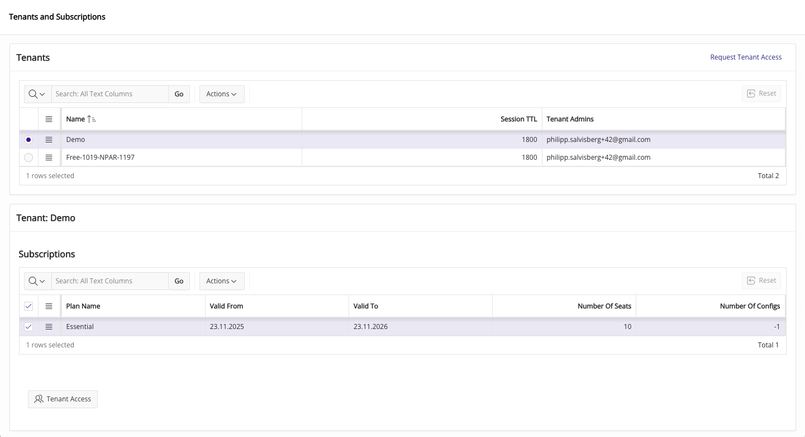

## Request Tenant Access

After creating a dbLinter Account for a [Starter Subscription (Free)](/dbLinter/getting-started/starter-subscription/#create-a-dblinter-account)
and signing in, you can request access to another tenant by clicking on the tenant button.

In the `Change Tenant` pop-up window click on `Request Tenant Access`.

In the next window enter the name of the tenant and press `Request Access`.

The tenant admin will then receive an email that looks like this:

## Approve Tenant Access Request

After you sign in as tenant admin, you will see a button that says `Pending Tenant Access Requests`.

Click on this button to open the `Tenant Access` page, where all pending access requests are listed.

Click on the check icon on the right of the name to approve a tenant access request.
Afterwards the new user is listed in the `Tenant Access` page.

Click on the pencil icon right to the user's email address to change the access rights.

## Tenants and Subscriptions

As a tenant admin you can view the tenants and the subscriptions you have access to.
Click on the user button (top right corner) and select `Tenants and Subscriptions` from the pop-up menu.

This will open the following page where you can press the `Tenant Access` button to manage the user access rights.

